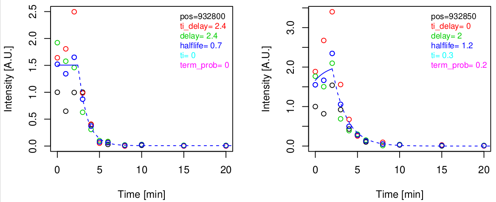
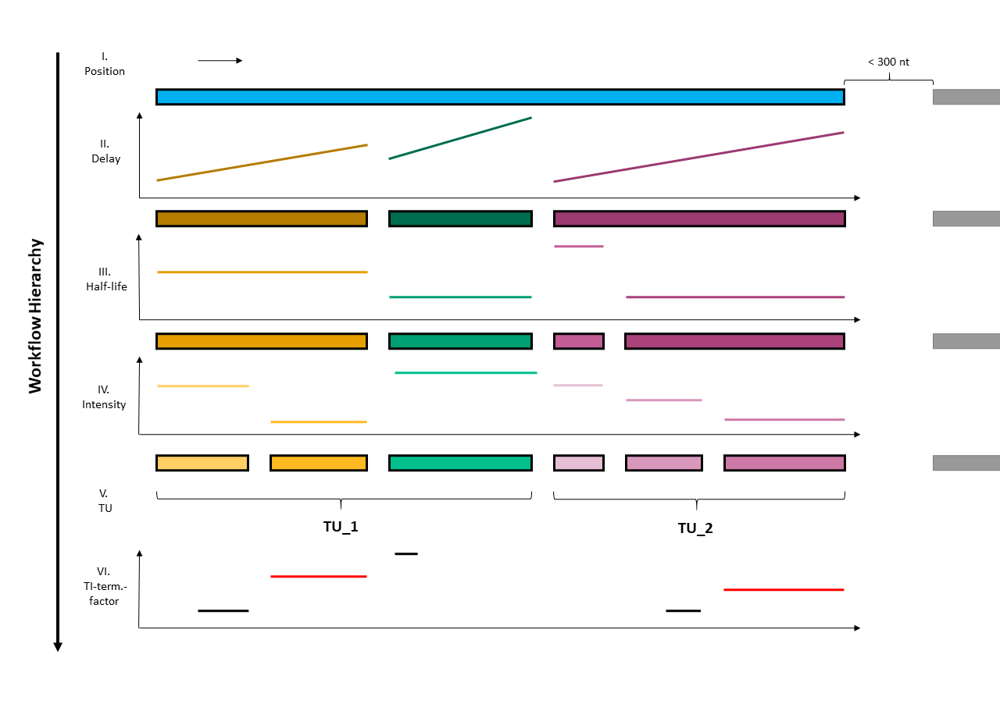
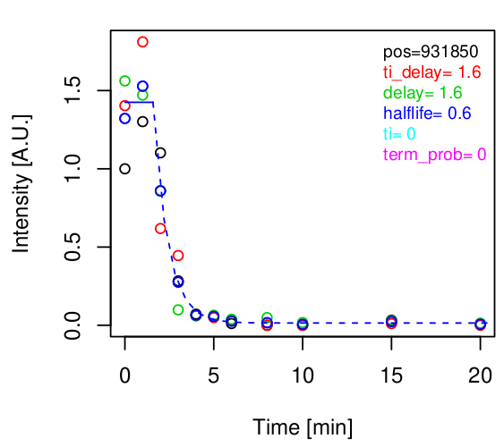
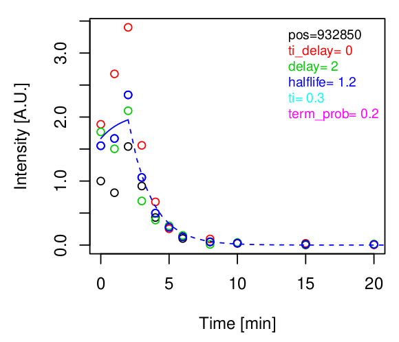
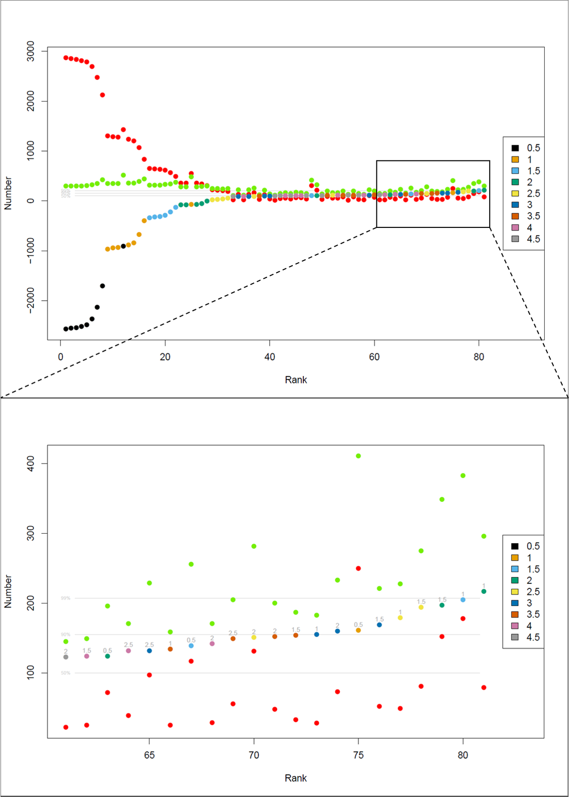
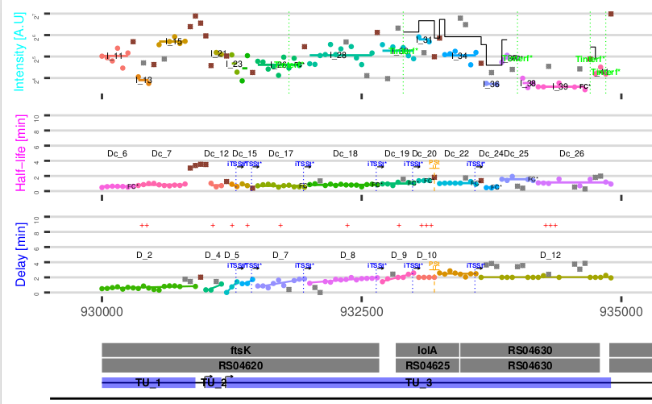
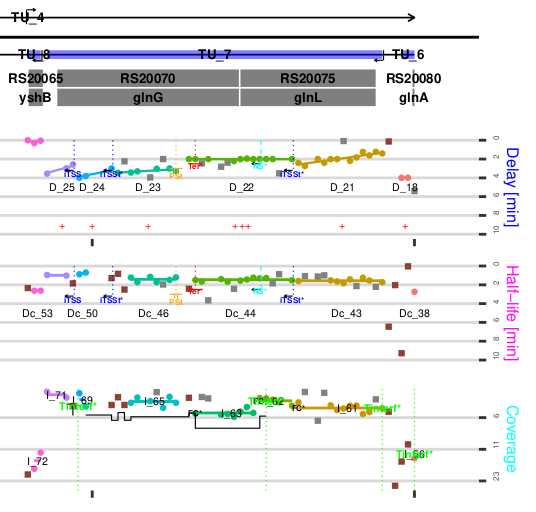

  

```{r setup, include = FALSE}
knitr::opts_chunk$set(
	echo = TRUE,
	message = TRUE,
	warning = TRUE
)
```

``` {r,echo = FALSE, message = FALSE}
require(rifi)
```

## 0. Installation
``` {r,eval = FALSE}
if (!requireNamespace("BiocManager", quietly = TRUE))
    install.packages("BiocManager")

BiocManager::install("rifi")
```

## I. Introduction

RNA sequencing and microarray data derived from rifampicin treated bacteria with
sufficiently high time resolution can reveal many insights into the mechanics of
transcription, RNAP velocity and RNA stability. 'rifi' is a transcriptome data
analysis tool for the holistic identification of regulatory processes, based on
such data. Rifi automizes the processes of fitting and utilizes a dynamic
programming attempt for the clustering of the genome by all values extracted
from the fit. The core part of data analysis by rifi is the utilization of one
of two non linear regression models applied on the time series data of each
*probe* (or *bin*), applying a standard model. The standard model consists of
two phases; the stationary phase and the exponential decay phase. From the
stationary phase, we extract the **delay**, is a measure of time that is needed
for the RNAP to reach the position of the probe in relation to the start of the
transcription. **velocity** could be extracted fitting delay to the positions.
From the exponential decay phase, we extract the **half-life** a measure of RNA
stability.  
In addition to the two phases of the standard model, the TI model is expanded by
a third phase, the delayed increase phase. The **TI-termination-factor**
extracted from this phase is a measure of transcription termination induced by
transcription interference. 
<br/><br/>
``` {r fit_models, echo=FALSE, fig.cap="**Fit models**", out.width = '100%'}

```
<br/><br/>
<p align="center">
**Figure 1**: Fits from both models. Left: the two-phase standard fit. Right
the TI model fits the increase in intensity. Black dotes represent the average
intensity for each timepoint, colored circles indicate the respective replicate.
</p>

From the extracted values **delay**, **half-life** and
**TI_termination_factor**, and the given values **position** and **intensity**
a fragmentation is performed hierarchically.  
Initially segments of bins are grouped by regions without significant sequencing
depth into **position_segments**. Those are grouped into **delay_fragments**
by common velocity. Subsequently, each delay-fragment is grouped by similar
half-life into **half_life_fragments**, on which the bins finally are grouped
into **intensity_fragments** by similar intensity. From the fragmentation, many
events can be extracted; **iTSS** (internal transcription start sites) type I
and type II, **pausing_sites**, **velocity_changes**,**processing_sites** and
**terminations**, as well as **TI** (transcription interference).<br/><br/>
<br/><br/>
``` {r hirarchy3, echo=FALSE, fig.cap="**Fragments Hirarchy**", out.width = '100%'}

```
<br/>
<p align="center">
Figure 2: The hierarchy of the workflow is separated into five steps. At first,
position segments are formed based on the distance to the next data point.
The threshold is 200 nucleotides. Next, segments are parted into delay
fragments. The delay fragments are parted by the half-life and likewise the
half-life fragments are parted by intensity. Groups of TUs are formed based
on the distance between the starts and ends of the delay fragments.
Finally, within TUs, TI fragments are formed.
</p>

## II. `rifi_preprocess`

The first step in the analysis of rifampicin time series data with rifi is
preprocessing. The three major steps are filtration, fitting the data to the
correct model and merge the coefficients and the input data frame into one
structure for the downstream process. The steps can be performed with five low
level functions or the wrapper function `rifi_preprocess` (see section 9.
`rifi_preprocess`). The following paragraphs describe the sub-steps of
`rifi_preprocess`. To directly read about the application or `rifi_preprocess`
jump to section. 9 `rifi_preprocess`.

### 1. The Input Data Frame

**input_df** is the input data frame processed by rifi. The data frame mainly
contains information about the relative intensities at all time points, but also
the time points themselves, probe identifier, and probe position and strand.  
Rifi package includes two example data frames: <em>*E.coli*</em> data from
RNAseq (data with replicates, input_df) and <em>*Synechocystis PCC 6803*</em>
data from microarrays (data with averaged replicates, see. "input_df").
<em>*E.coli*</em> is the input for this tutorial.
<br/><br/>
``` {r}
data(example_input_e_coli)
#to show a sample of the output, not all columns are depicted.
example_input_e_coli[238:254, c(1:4,ncol(example_input_e_coli)-2, ncol(example_input_e_coli)-1, ncol(example_input_e_coli))]
```
<br/><br/>
``` {r}
data(example_input_synechocystis_6803)
head(example_input_synechocystis_6803)
```
<br/>
All columns in Rifi input data table except the last three contain the relative
intensity measurements, with the first column referring to timepoint zero, at or
before the addition of rifampicin. The last three columns contain the unique ID
that is identical for each replicate, the position on the genome and strand
information (“+”,”-“).

The input data frame needs to comply to the following rules:

1.  The columns with relative intensities need to be numeric.
2.  The first column is called "0" and refers to the first time point (before
    rifampicin addition).
3.  The three columns after time columns are "ID", "position" and "strand" in
    this order.
4.  The column "strand" needs to contain only NA, when no strand information is
    given or "+" and/or "-", when strand information is given (input_df for
    <em> *E.coli*</em> and "input_df" for <em>*Synechocystis PCC 6803*</em>).
5.  Each ID in the column "ID" refers to the same, unique strand/position
    combination. Thus, each replicate has to share the same ID.
6.  IDs could be either numeric (advised) or character strings that do not
    contains "|","_" or ",".
7.  All intensities columns could contain 0 or NA except the column "0". The
    intensities are normalized to column "0"
<br/><br/>

### 2. `check_input`

Not complying to any of the rules will result in one of the following errors
and/or warnings by running "check_input": <br/><br/>

<details><summary>**See all errors and warnings**</summary>
<p>    

```{r, echo = FALSE, error=TRUE, warning=TRUE, message=TRUE, purl=FALSE}
print("Rule 1")
input_df_1 <- example_input_e_coli
colnames(input_df_1)[2] <- "TWO"
check_input(inp = input_df_1)
print("Rule 2")
input_df_2 <- example_input_e_coli
colnames(input_df_2)[1] <- 2
check_input(inp = input_df_2)
print("Rule 3")
input_df_3 <- example_input_e_coli
colnames(input_df_3)[ncol(input_df_3)] <- "Banana"
obj <- check_input(inp = input_df_3, thrsh = -1)
print("Rule 4")
input_df_4 <- example_input_e_coli[which(example_input_e_coli$strand == "+"),]
input_df_4$strand <- "minus"
obj <- check_input(inp = input_df_4, thrsh = -1)
input_df_4 <- example_input_e_coli
input_df_4$strand[1:3] <- "negative"
obj <- check_input(inp = input_df_4, thrsh = -1)
input_df_4 <- example_input_e_coli
input_df_4$strand <- c("minus","plus","none")
obj <- check_input(inp = input_df_4, thrsh = -1)
print("Rule 5")
input_df_5 <- example_input_e_coli
input_df_5$ID[1:6] <- 1
obj <- check_input(inp = input_df_5, thrsh = -1)
input_df_5 <- example_input_e_coli
input_df_5$ID[1:6] <- 1:6
obj <- check_input(inp = input_df_5, thrsh = -1)
print("Rule 6")
input_df_6 <- example_input_e_coli
input_df_6$ID[1:3] <- "my_name|my,name"
obj <- check_input(inp = input_df_6, thrsh = -1)
print("Rule 7")
input_df_7 <- example_input_e_coli
obj <- check_input(inp = input_df_7[241:247,])
```

</p>
</details>
<br>
As our standard input contains
probes that are not expressed and thus have a relative intensity of 0 at time
point 0, in our example check_input gives a warning on which IDs have been
removed, but the output can be safely used.  
The result contains the processed input data frame.  
<br/><br/>
``` {r check_input}
result <- check_input(inp = example_input_e_coli, thrsh = 0)
head(result$input_df)
```
<br/><br/>
   **inp** data frame: dataframe containing the relative intensities for each
    timepoint as well as information about ID, position and strand and the
    addition column of segment positions
    
   **thrsh** integer: is used to remove all replicates with an intensity of 0
    or below from the input dataframe
<br/><br/>

### 3. `Filtration_Below_Background`

At this point, a custom filtration function can be applied to remove replicates
that are below the background.

This is especially useful for microarrays data. We supply a function **TODO**
that filters for background but retains replicates that show a promising pattern
even when they are below background. When a different custom function is applied
within `rifi_preprocess` the input variable x must refer to the intensity vector
over all timepoints. The output must be a character string containing **FLT**
for all replicates that should be filtered. Additional arguments must be hard
coded or given as default value, as additional arguments can not be passed into
`rifi_preprocess`.  

Application outside of `rifi_preprocess` can modify the 'filtration' column in
the input dataframe in any way, as that rows with replicates that should be
filtered contain the character string **FLT**.
<br/><br/>
``` {r,echo=FALSE}
print("examples for the filtration column. The first three, but not the last
      three lines would be filtered")
result$input_df$filtration[1:6] <- c("FLT", "_FLT_", "_FLT_your_text", NA, "_",
                              "_passed_")
head(result$input_df[,9:15])
```
<br/><br/>

### 4. `make_df`

`make_df` converts the input data frame to the template probe based data frame.
The means of all replicates, excluding the filtered replicates, are calculated.
Optionally, probes or bins, where all replicates are filtered can be removed,
when rm_FLT is set to TRUE (default is FALSE).  
The column **probe_TI** is added for a later step, in which it is decided which
probes are fitted with the TI model (see 7. finding_TI).  
For microarray data, the probes with intensity of the latest time point does not
fall below the background are considered stables mRNA. Those probes are marked
in the **flag** column with the tag '_ABG_'("above background"). 'bg' is the
relative intensity threshold of the background. For RNAseq data the 'ABG'
sub-model is used and bg is set to 0, so that all probes are flagged as
'_ABG_'. The flag column is used to distribute different probes to the
different fitting models (see 7. finding_TI) The output of 'make_df' is the
probe based dataframe **probe_df**. At this stage, it contains the columns
**ID**, **position**, **strand** and **intensity** (of time point 0) as mean of
all replicates from the input dataframe and the columns **probe_TI** and
**flag**. For our tutorial bg is set to 0, because its RNAseq data, and rm_FLT
is T to remove ID 18558 that we tagged with "FLT","_" and "_FLT_your_text".
<br/><br/>
``` {r make_df}
probe_df <- make_df(inp = result$input_df, cores = 2, bg = 100, rm_FLT = T)
head(probe_df)
```
<br/><br/>
   **y** numeric: vector of values

   **z** numeric/character: vector of identifiers (IDs in our case)

   **pen** integer: penalty value

   **stran** logical: TRUE/FALSE

   **n_out** integer: number of allowed outliers

### 5. `segment_pos`

For the segmentation into **position-segments** by regions without significant
sequencing depth, `segment_pos` is called. This step is needed to enhance
performance of the program, since large position segments increase the
runtime.  
The size of the regions without significant sequencing depth (aka positions not
present in the dataframe) or absence of probes is determined by the argument
**dist** (default is 300). Lower numbers create more, but smaller position
segments. Position segments are strand specific.
<br/><br/>
``` {r segment_pos}
probe_df <- segment_pos(probe = probe_df, dista = 300)
probe_df[132:142,]
```
<br/><br/>
  - **probe** data frame: dataframe containing the relative intensities for each
    timepoint as well as information about ID, position and strand and the
    addition column of segment positions.
  - **dista** integer: distance threshold referring to absence of probes or
    expression.
<br/><br/>

### 6. `finding_PDD`

Post transcription decay model is characterized by a strong decrease of
intensity by position. `finding_PDD` flags potential candidates for post
transcription decay with "_PDD_". `finding_PDD` uses 'score_fun_linear'
function to make groups by the difference to the slope. The input data contains
**ID**, **intensity**, **position** and **position_segment** columns.
`finding_PDD` needs additional parameters as **pen**, **pen_out** and **thrsh**
<br/><br/>
``` {r finding_PDD, eval = FALSE}
#Due to increased run time, this example is not evaluated in the vignette
probe_df <- finding_PDD(probe = probe_df, cores = 2, pen = 2, pen_out = 2,
                        thrsh = 0.001)
```
<br/>
   **probe** data frame: dataframe output of `segment_pos`

   **cores** integer: number of assigned cores for the task

   **pen** integer: an internal parameter for the dynamic programming. Higher
    values result in fewer fragments. Advised to be kept at 2. Default is 2

   **pen_out** integer: an internal parameter for the dynamic programming.
    Higher values result in fewer possible outliers. Advised to be kept at 1.
    Default is 1

   **thrsh** integer: an internal parameter that allows fragments with slope.
    steeper than the threshold to be flagged with "_PDD_". Higher value
    result in fewer candidates. Advised to be kept at 0.001. Default is 0.001

### 7. `finding_TI`

`finding_TI` identifies regions of potential transcription interference (TI).
`finding_TI` uses `score_fun_ave` to make groups by the mean of "probe_TI". The
identified regions and a defined number of probes before the potential TI event
are flagged with '_TI_'. The identification is based on the probe_TI column,
which is a report for each probe, whether a later time point is higher in
relative intensity than the first time point. The input data contains **ID**,
**intensity**, **position** and **position_segment** columns. `finding_TI`
needs additional parameters as **pen**, **thrsh** and **add**.
<br/><br/>
``` {r finding_TI, eval=FALSE}
#Due to increased run time, this example is not evaluated in the vignette
probe_df <- finding_TI(probe = probe_df, cores = 2, pen = 10, thrsh = 0.5,
                       add = 1000)
```
<br/>
   **probe** data frame: dataframe dataframe output of `finding_PDD`
   
   **pen** integer: internal parameter for the dynamic programming (see
   `rifi_preprocess`). Higher values result in fewer fragments. Default
    is 10
    
   **thrsh** integer: defines that percentage, where 0.5 refers to 75% of
    probes and -0.5 to 25%. When set to -1, everything is flagged as TI
    
   **add** integer: defines the number of nucleotides before the potential TI
    event that should be flagged as TI as well (default is 1000 nucleotides)


### 8. Fit Specific Filtrations

Similar to the filtration below background (see. 3), filtration can be applied
specifically for each of the two fits. When a custom function is applied within
`rifi_preprocess`, the input variable x must refer to the intensity vector over
all timepoints, the output must be a character string containing **FLT** for all
replicates that should be filtered. Additional arguments must be hard coded or
given as default value, as additional arguments can not be passed into
`rifi_preprocess`.  
Application outside of `rifi_preprocess` can modify the 'filtration' column in
the input dataframe, as that rows with replicates that should be filtered
contain the character string **FLT**.

### 9. `rifi_preprocess`

All preprocessing steps can be run with `rifi_preprocess` at once. This section
will focus on all possible arguments that can be passed to the function.
<br/><br/>
``` {r rifi_preprocess}
#From here on the examples are shown on minimal examples.
#Two bigger data sets can be used to run the example as well.
#data(example_input_e_coli) 
#data(example_input_synechocystis_6803)
data(example_input_minimal)
preprocess_minimal <- rifi_preprocess(example_input_minimal, cores = 2,
                             FUN_filter_BG = function(x){"_"},
                             FUN_filter_STD = function(x){"_"}, 
                             FUN_filter_TI = function(x){"_"},bg = 0,
                             rm_FLT = F, thrsh_check = 0, dista = 300,
                             run_PDD = FALSE, pen_PDD = 2, pen_out_PDD = 1,
                             thrsh_PDD = 0.001, pen_TI = 10, thrsh_TI = 0.5,
                             add = 1000)
head(preprocess_minimal)
```
<br/>

   **inp**: The input dataframe containing the relative intensities for each
    timepoint as well as information about ID, position and strand
    ("input_df").

   **cores**: the number of assigned cores for the task

   **FUN_filter_BG**: A function of x, returning a character string containing
    **FLT**. x is the numeric vector of the intensity from all time points.

   **FUN_filter_STD**: A function of x, returning a character string containing
   **FLT**. x is the numeric vector of the intensity from all time points.

   **FUN_filter_TI**: A function of x, returning a character string
    containing **FLT**. x is the numeric vector of the intensity from all time
    points.

   **bg**: For microarrays data, a threshold over which the last time point has
    to be fitted with the above background mode. Should be roughly the
    background value. Set to 0 for RNAseq data.

   **rm_FLT**: Set to TRUE to remove probes, where all replicates are
    filtered.

   **logbook**: Per default a new logbook is generated to save information
    about penalties, if a logbook already exists it would be used.

   **thrsh_check**: The thrsh argument is used to remove all replicates with
    an intensity of 0 or below from the input dataframe. As well it could be
    used to remove all replicates with an intensity below this threshold.

   **dista**: The amount of nucleotides between two position segments.

   **pen_PDD**: The 'pen_PDD' argument is an internal parameter for the
    dynamic programming and defaults to 2.

   **pen_out_PDD**: The 'pen_out_PDD' argument is an internal parameter for
    the dynamic programming and defaults to 1.

   **thrsh_PDD**: the 'thrsh_PDD' argument is an internal parameter that
    allows fragments with slopes steeper than the threshold to be flagged with
    "_PDD_". Higher values result in fewer candidates. Advised to be kept
    at 0.001. Default is 0.001.

   **pen_TI**: The 'pen_TI' argument is an internal parameter for the dynamic
    programming and defaults to 10.

   **thrsh_TI**: The 'thrsh_TI' argument defines the percentage of probes
    with higher relative intensity at time points later than 0 needed to flag
    the region as TI, where 0.5 refers to 75% of probes and -0.5 to 25%. When
    set to -1, everything is flagged as TI.

   **add**: range of nucleotides before a potential TI event wherein IDs are
    fitted with the TI fit.
    

## III. `rifi_fit`

`rifi_fit` wraps all fitting steps. The fitting functions fit the intensities
against the time series data. The first uses `nls2_fit` function to estimate
**delay**, **half-life**, **first time point intensity** and **background
intensity**. The second uses `TI_fit` function to estimate **delay** and
**half-life** additionally to the **TI-termination-factor**.

The function used are:

  1.  `nls2_fit`
  2.  `TI_fit`
  3.  `plot_nls2`
  4.  `plot_singleProbe_function`
<br/><br/>
``` {r rifi_fit}
#Two bigger data sets can be used to run the example as well.
#data(preprocess_e_coli) 
#data(preprocess_synechocystis_6803)
data(preprocess_minimal)
fit_minimal <- rifi_fit(inp = preprocess_minimal$input_df,
                     probe = preprocess_minimal$probe_df, cores = 2, viz = F,
                     details = F, restr = 0.2, decay=seq(.08, 0.11, by=.02),
                     delay=seq(0,10, by=.1), k=seq(0.1,1,0.2), intyf=0.2,
                     TI_k = seq(0, 1, by = 0.5),
                     TI_decay = c(0.05, 0.1, 0.2, 0.5, 0.6),
                     TI = seq(0, 1, by = 0.5), TI_delay = seq(0, 2, by = 0.5),
                     TI_rest_delay = seq(0, 2, by = 0.5))
fit_minimal
```
<br/>
   **inp** data frame: the input data frame with correct format

   **probe** data frame: the probe based data frame

   **cores** integer: the number of assigned cores for the task

   **details** logical: T/F to return the fit objects or just the probe

   **viz** logical: T/F to visualize the output

   **details** logical: T/F to give a more detailed output

   **restr** numeric: a parameter that restricts the freedom of the fit to
    avoid wrong TI-term_factors, ranges from 0 to 0.2

   **decay** numeric vector: A sequence of starting values for the decay
    Default is seq(.08, 0.11, by=.02)

   **delay** numeric vector: A sequence of starting values for the delay.
    Default is seq(0,10, by=.1)

   **k** numeric vector: A sequence of starting values for the synthesis rate.
    Default is seq(0.1,1,0.2)

   **intyf** numeric vector: A sequence of starting values. Default is 0.2

   **TI_k** numeric vector: A sequence of starting values for the synthesis
    rate. Default is seq(0, 1, by = 0.5)

   **TI_decay** numeric vector: A sequence of starting values for the decay.
    Default is c(0.05, 0.1, 0.2, 0.5, 0.6)

   **TI** numeric vector: A sequence of starting values for the TI. Default is
    seq(0, 1, by = 0.5)

   **TI_delay** numeric vector: A sequence of starting values for the delay.
    Default is seq(0, 2, by = 0.5)

   **TI_rest_delay** numeric vector: A sequence of starting values. Default
    is seq(0, 2, by = 0.5)


### 1. `nls2_fit`

`nls2_fit` function uses **nls2** function to fit a probe or bin using
intensities from different time point. **nls2** is able to use different
starting values using expand grid and select the best fit. The input data are
two data frame, a data frame containing **intensity** of all timeserie, **ID**,
**position** and **strand** ("input_df") and a data frame containing **ID**,
**intensity**, **position**, **probe_TI**, **flag** and **position_segment**
columns (see below Table_2). `nls2_fit` function has two different models, one
includes the background as parameter and estimates decay subtracting it. The
other excludes the background coefficient and is applied for probes flagged with
***ABG***. All probes flagged with ***FLT*** are not fitted as they are below
background. Finally probes flagged with ***TI*** are fitted with TI model. The
output data is an extension of Table_2, **delay** and **half-life**
coefficients are added (see below "head(probe)").
<br/><br/>
``` {r echo = T}
data(preprocess_e_coli)
head(preprocess_e_coli[[1]])
```
<br/><br/>
``` {r echo = T}
data(preprocess_e_coli)
Table_2 <- preprocess_e_coli[[2]]
head(Table_2[,c(1:4,12:ncol(Table_2))])
```
<br/><br/>
``` {r nls2_fit}
nls2_fit(inp=preprocess_minimal$input_df, probe=preprocess_minimal$probe_df,
         cores=1, decay=seq(.08, 0.11, by=.02), delay=seq(0, 10, by=.1),
         k=seq(0.1, 1, 0.2), intyf = 0.2)
```
<br/>

   **data_i**: The input dataframe containing the relative intensities for
    each timepoint as well as information about ID, position, strand and
    filtration (Table_1).

   **data_f**: The input data frame with **ID**, **position**, **strand**,
    **intensity**, **probe_TI**, **flag** and **position_segment**. Intensity
    column refers to time 0 (Table_2).

   **cores** integer: the number of assigned cores for the task.

   **decay** numeric vector: A sequence of starting values for the decay.
    Default is seq(.08, 0.11, by=.02).

   **delay** numeric vector: A sequence of starting values for the delay.
    Default is seq(0, 10, by=.1).

   **k** numeric vector: A sequence of starting values for the synthesis rate.
    Default is seq(0.1, 1, 0.2).

   **intyf** numeric vector: A sequence of starting values. Default is 0.2.
<br/><br/>
``` {r echo = T}
data(fit_minimal)
Table_3 <- fit_minimal[,-ncol(fit_minimal)]
head(Table_3)
```
<br/><br/>

### 2. `TI_fit`

`TI_fit` estimates transcription interference and termination factor using nls
function for probe or bin flagged as **TI**. It estimates the transcription
interference level (referred later to TI) as well as the transcription factor
fitting the probes/bins with nls function looping into several starting values.
To determine **TI** and **termination factor**, `TI_fit` function is applied to
the flagged probes and to the probes localized 200 nucleotides upstream. Before
applying `TI_fit` function, some probes/bins are filtered out if they are below
the background using `generic_filter_BG`. The model loops into a dataframe
containing sequences of starting values and the coefficients are extracted from
the fit with the lowest residuals. When many residuals are equal to 0, the
lowest residual can not be determined and the coefficients extracted could be
wrong. Therefore, a second filter was developed. First a loop is applied into
all starting values, nls objects are collected in tmp_v vector and the
corresponding residuals in tmp_r vector. The residuals are sorted and those non
equal to 0 are collected into a vector. If the first values are not equal to 0,
the best 20% of the list are collected in tmp_r_min vector and the minimum
termination factor is selected. On the other hand residuals between 0 to 20% of
the values collected in tmp_r_min vector are gathered. The minimum termination
factor coefficient is determined and stored. The coefficients are gathered in
res vector and saved as an object. The output data is an extension of Table_2,
**delay**, **half-life** and **TI_termination_factor** coefficients are added
(see. "head(probe)").
<br/><br/>
``` {r TI_fit}
TI_fit(inp = preprocess_minimal$input_df, probe = preprocess_minimal$probe_df,
       cores=1, restr = 0.01, k = seq(0, 1, by = 0.5),
       decay = c(0.05, 0.1, 0.2, 0.5, 0.6), ti = seq(0, 1, by = 0.5),
       ti_delay = seq(0, 2, by = 0.5), rest_delay = seq(0, 2, by = 0.5))
```
<br/>

   **data_i**: The input dataframe containing the relative intensities for
    each timepoint as well as information about ID, position, strand and
    filtration (Table_1)

   **data_f**: The input data frame with **ID**, **position**, **strand**,
    **intensity**, **probe_TI**, **flag** and **position_segment**. Intensity
    column refers to time 0 (Table_2)
    
   **cores** integer: the number of assigned cores for the task

   **decay** numeric vector: A sequence of starting values for the decay.
    Default is seq(.08, 0.11, by=.02).

   **delay** numeric vector: A sequence of starting values for the delay.
    Default is seq(0, 10, by=.1).

   **k** numeric vector: A sequence of starting values for the synthesis rate.  
   Default is seq(0.1, 1, 0.2).

   **intyf** numeric vector: A sequence of starting values. Default is 0.2.
<br/><br/>
``` {r echo = T}
data(fit_minimal)
head(fit_minimal)
```
<br/><br/>

### 3. `plot_nls2`

`plot_nls2` plots the fit from nls2 with the corresponding coefficients,
**delay** and **decay**. **delay** is indicated on the x-axis and **half_life**
is calculated from ln2/decay. The output is shown on nls2Plot figure.
<br/><br/>
``` {r plot_nls2, eval=F}
plot_nls2_function(data = fit_nls[[2]], inp = inp, cores = cores)
```
<br/><br/>
   **data** data frame: data frame output from nls2 fit with the coefficients
    (Table_3).
   **inp** data frame: data frame with the intensities from different timepoint
    (Table_1).
   **cores** integer: the number of assigned cores for the task.
<br/><br/>
``` {r nls2Plot, echo=FALSE, fig.cap="**Standard fit with nls2**", out.width = '100%'}

```
<br/><br/>

### 4. `plot_singleProbe`

`plot_singleProbe` plots the fit from TI with the corresponding coefficients,
**delay**, **ti_delay**, **half_life**, **TI_termination_factor** and
**TI**. Additional parameters are included on the legend a, the output is shown
on TIPlot figure.
<br/><br/>
``` {r plot_singleProbe, eval=F}
plot_singleProbe_function(data = res4[[2]], inp = inp, cores = cores)
```
<br/><br/>
   **data** data frame: data frame output from TI fit with the coefficients
    (Table_4)
    
   **inp** data frame: data frame with the intensities from different timepoint
    (Table_1)
    
   **cores** integer: the number of assigned cores for the task.
<br/><br/>
``` {r TIPlot, echo=FALSE, fig.cap="**TI model fit**", out.width = '100%'}

```
<br/><br/>
The parameters included on the legend:

   **id**: ID of the probe or bin

   **pos**: position on the genome the end of the delay

   **delay**: delay predicted by TI_fit. The time taken by the RNAP to reach
    the point of the termination by TI.

   **ti_delay**: time between the timepoint at which the TI effect starts to
    wear off and the time point at which the delay ends

   **half_life**: decay coefficient (ln2/decay)

   **TI**: termination factor

   **term_prob**: TI termination factor

## III. `rifi penalties`

`rifi_penalties` wraps all penalty steps, wraps the functions: `make_pen` and
`viz_pen_obj.` For use of this wrapper jump to 3. `rifi_penalties`

### 1. `make_pen`

`make_pen` calls one of four available penalty functions to automatically assign
penalties for the dynamic programming. Four functions are called:

1.  `fragment_delay_pen`

2.  `fragment_HL_pen`

3.  `fragment_inty_pen`

4.  `fragment_TI_pen`

These functions return the amount of statistically correct and statistically
wrong splits at a specific pair of penalties. 'make_pen' iterates over many
penalty pairs and picks the most suitable pair based on the difference between
wrong and correct splits. The sample size, penalty range and resolution as well
as the number of cycles can be customized. The primary start parameters create a
matrix with n = rez_pen rows and n = rez_pen_out columns with values between
sta_pen/sta_pen_out and end_pen/end_pen_out. The best penalty pair is
picked. If dept is bigger than 1 the same process is repeated with a new matrix
of the same size based on the result of the previous cycle. Only position
segments with length within the sample size range are considered for the
penalties to increase run time. ALso, outlier penalties cannot be smaller
than 40% of the respective penalty. `make_pen` returns a penalty object (list
of 4 objects) the first being the logbook.
<br/><br/>
``` {r make_pen}
data(fit_minimal)
logbook<-as.numeric(rep(NA,8))
pen_delay<-make_pen(probe = fit_minimal, FUN = rifi:::fragment_delay_pen,
                    cores = 2, logs = logbook, dpt = 1, smpl_min=0,
                    smpl_max=18, sta_pen = 0.5, end_pen = 4.5, rez_pen = 9,
                    sta_pen_out = 0.5, end_pen_out = 3.5, rez_pen_out = 7)
pen_HL<-make_pen(probe = fit_minimal, FUN = rifi:::fragment_HL_pen,
                 cores = 2, logs = logbook, dpt = 1, smpl_min=0,
                 smpl_max=18, sta_pen = 0.5, end_pen = 4.5, rez_pen = 9,
                 sta_pen_out = 0.5, end_pen_out = 3.5, rez_pen_out = 7)
pen_inty<-make_pen(probe = fit_minimal, FUN = rifi:::fragment_inty_pen,
                   cores = 2, logs = logbook, dpt = 1, smpl_min=0,
                   smpl_max=18, sta_pen = 0.5, end_pen = 4.5, rez_pen = 9,
                   sta_pen_out = 0.5, end_pen_out = 3.5, rez_pen_out = 7)
pen_TI<-make_pen(probe = fit_minimal, FUN = rifi:::fragment_TI_pen,
                 cores = 2, logs = logbook, dpt = 1, smpl_min=0,
                 smpl_max=18, sta_pen = 0.5, end_pen = 4.5, rez_pen = 9,
                 sta_pen_out = 0.5, end_pen_out = 3.5, rez_pen_out = 7)
```
<br/>
   **probe** data frame: the probe based data frame.

   **FUN** function: one of the four bottom level functions (see details).

   **cores** integer: the number of assigned cores for the task.

   **logs** numeric vector: the logbook vector.

   **dpt** integer: the number of times a full iteration cycle is repeated with
    a more narrow range based on the previous cycle. Default is 2.

   **smpl_min** integer: the smaller end of the sampling size. Default is 10.

   **smpl_max** integer: the larger end of the sampling size. Default is 100.

   **sta_pen** numeric: the lower starting penalty. Default is 0.5.

   **end_pen** numeric: the higher starting penalty. Default is 4.5.

   **rez_pen** numeric: the number of penalties iterated within the penalty
    range. Default is 9.

   **sta_pen_out** numeric: the lower starting outlier penalty. Default is 0.5.

   **end_pen_out** numeric: the higher starting outlier penalty. Default is 3.5.

   **rez_pen_out** numeric: the number of outlier penalties iterated within
    the outlier penalty range. Default is 7.
<br/><br/>

#### 1. `fragment_delay_pen`

`fragment_delay_pen` is called by `make_pen` function to automatically assign
penalties for the dynamic programming of delay fragment. The function used for
`fragment_delay_pen` is `score_fun_linear`. `score_fun_linear` scores the values
of y on how close they are to a linear fit, for more details check
`functions_scoring.r`.
<br/><br/>

#### 2. `fragment_HL_pen`

`fragment_HL_pen` is called by `make_pen` function to automatically assign
penalties for the dynamic programming of delay fragment. The function used for
`fragment_HL_pen` is `score_fun_ave`. `score_fun_ave` scores the values of y on
how close they are to the mean, for more details check 'functions_scoring.r'.
<br/><br/>

#### 3. `fragment_inty_pen`

`fragment_inty_pen` is called by `make_pen` function to automatically assign
penalties for the dynamic programming of delay fragment. The function used for
`fragment_inty_pen` is `score_fun_ave`. `score_fun_ave` scores the values of y
on how close they are to the mean, for more details check
'functions_scoring.r'.
<br/><br/>

#### 4. `fragment_TI_pen`

`fragment_TI_pen` is called by `make_pen` function to automatically assign
penalties for the dynamic programming of delay fragment. The function used for
`fragment_TI_pen` is `score_fun_ave`. `score_fun_ave` scores the values of y on
how close they are to the mean, for more details check 'functions_scoring.r'.

   **probe** data frame: the probe based data frame

   **pen** numeric: the number of penalties iterated within the penalty range

   **pen_out** numeric: the number of penalties assigned for outliers iterated
    within the penalty range

   **from** numeric: the size of the shortest considered position segment

   **to** numeric: the size of the longest considered position segment

   **cores** integer: the number of assigned cores for the task
<br/>

### 2. `viz_pen_obj`

`viz_pen_obj` an optional visualization of any penalty object created by
make_pen and can be customized to show only the n = top_i top results. Results
are ranked from worst to best for correct-wrong ratio, and color coded by
penalty, while the outlier-penalty is given as a number for each point. Red and
green dots represent the wrong and correct splits respectively.
<br/><br/>
``` {r viz_pen_obj, eval=F}
viz_pen_obj(obj = pen_delay, top_i = 10)
```
<br/>
   **obj** object: penalty object (make_pen output)
   **top_i** integer: the number of top results visualized. Default is all.
<br/><br/>
``` {r penalty, echo=FALSE, fig.cap="**penalty plot**", out.width = '100%'}

```
<br/>
<p align="center">

**Figure 4**: The graphic shows penalties ranked by the correct fits subtracted
by the wrong fits. Each penalty corresponds to a color given in the legend. Red
dots represent wrong splits, green dots represent correct splits. In the zoomed
window (bottom) numbers above the dots represent the outlier-penalty.
</p>
<br/><br/>

### 3. `rifi_penalties`
<br/><br/>
``` {r rifi_penalties}
data(fit_minimal)
penalties_minimal <-  rifi_penalties(probe = fit_minimal, details = TRUE,
                                     viz = FALSE, top_i = 25, cores = 2,
                                     dpt = 1, smpl_min = 0, smpl_max = 18,
                                     sta_pen = 0.5, end_pen = 4.5, rez_pen = 9,
                                     sta_pen_out = 0.5, end_pen_out = 4.5,
                                     rez_pen_out = 9)
```
<br/>
   **probe** data frame: the probe based data frame

   **details** logical: whether to return the penalty objects or just the
    logbook.

   **viz** logical: whether to visualize the output or not. Default is FALSE

   **top_i** integer: the number of top results visualized. Default is all

   **cores** integer: the number of assigned cores for the task

   **dpt** integer: the number of times a full iteration cycle is repeated with
    a more narrow range based on the previous cycle. Default is 2

   **smpl_min** integer: the smaller end of the sampling size. Default is 10

   **smpl_max** integer: the larger end of the sampling size. Default is 100

   **sta_pen** numeric: the lower starting penalty. Default is 0.5

   **end_pen** numeric: the higher starting penalty. Default is 4.5

   **rez_pen** numeric: the number of penalties iterated within the penalty
    range. Default is 9

   **sta_pen_out** numeric: the lower starting outlier penalty. Default is 0.5

   **end_pen_out** numeric: the higher starting outlier penalty. Default is 3.5

   **rez_pen_out** numeric: the number of outlier penalties iterated within
    the outlier penalty range. Default is 7.
<br/><br/>

## IV. `rifi fragmentation`

`rifi_fragmentation` conveniently wraps all fragmentation steps, wraps the
functions: `fragment_delay`, `fragment_HL`, `fragment_inty`, `TUgether` and
`fragment_TI`.
<br/>
The functions called are:

1.  `fragment_delay`
2.  `fragment_HL`
3.  `fragment_inty`
4.  `fragment_TI`
5.  `TUgether`
<br/><br/>
``` {r rifi_fragmentation}
data(fit_minimal)
data(penalties_minimal)
fragmentation_minimal <-  rifi_fragmentation(probe = fit_minimal, cores = 2,
  logbook = penalties_minimal,
  pen_delay = penalties_minimal["delay_penalty"],
  pen_out_delay = penalties_minimal["delay_outlier_penalty"],
  pen_HL = penalties_minimal["half_life_penalty"],
  pen_out_HL = penalties_minimal["half_life_outlier_penalty"],
  pen_inty = penalties_minimal["intensity_penalty"],
  pen_out_inty = penalties_minimal["intensity_outlier_penalty"],
  pen_TU = -0.75,
  pen_TI = penalties_minimal["TI_penalty"],
  pen_out_TI = penalties_minimal["TI_outlier_penalty"])
```
<br/>
   **probe** probe data frame: the probe based data frame

   **cores** integer: the number of assigned cores for the task

   **logbook** numeric vector: the logbook vector, if it exists

   **pen_delay** numeric: an internal parameter for the dynamic programming.
    Higher values result in fewer fragments. Default is the auto generated
    value

   **pen_out_delay** numeric: an internal parameter for the dynamic
    programming. Higher values result in fewer allowed outliers. Default is the
    auto generated value

   **pen_HL** numeric: an internal parameter for the dynamic programming.
    Higher values result in fewer fragments. Default is the auto generated
    value

   **pen_out_HL** numeric: an internal parameter for the dynamic programming.
    Higher values result in fewer allowed outliers. Default is the auto
    generated value

   **pen_inty** numeric: an internal parameter for the dynamic programming.
    Higher values result in fewer fragments. Default is the auto generated
    value

   **pen_out_inty** numeric: an internal parameter for the dynamic
    programming. Higher values result in fewer allowed outliers. Default is the
    auto generated value

   **pen_TI** numeric: an internal parameter for the dynamic programming.
    Higher values result in fewer fragments. Default is the auto generated
    value

   **pen_out_TI** numeric: an internal parameter for the dynamic programming.
    Higher values result in fewer allowed outliers. Default is the auto
    generated value
<br/><br/>
``` {r echo = T}
data(fragmentation_minimal)
head(fragmentation_minimal)
```
<br/><br/>

### 1. `fragment_delay`

`fragment_delay` makes delay_fragments based on position_segments and assigns
all gathered information to the probe based data frame. The columns
"delay_fragment", "velocity_fragment", "intercept" and "slope" are added.
`fragment_delay` makes delay_fragments, assigns slopes, velocity (1/slope) and intercepts for the TU calculation.
<br/><br/>
The function used are:

   `score_fun_linear`

`score_fun_linear` is the score function used by dynamic programming for delay
fragmentation, for more details, see below.
<br/><br/>
``` {r fragment_delay}
probe_df<-fragment_delay(probe = fit_minimal, cores = 2,
                         pen = penalties_minimal["delay_penalty"],
                         pen_out = penalties_minimal["delay_outlier_penalty"])
head(probe_df)
```
<br/>
   **probe** data frame: the probe based data frame

   **cores** cores: integer: the number of assigned cores for the task

   **pen** numeric: an internal parameter for the dynamic programming. Higher
    values result in fewer fragments. Default is the auto generated value

   **pen_out** numeric: an internal parameter for the dynamic programming
    Higher values result in fewer allowed outliers. Default is the auto
    generated value
<br/><br/>

### 2. `fragment_HL`

`fragment_HL` performs the half_life fragmentation based on delay_fragments
and assigns all gathered information to the probe based data frame. The columns
"HL_fragment" and "HL_mean_fragment" are added. `fragment_HL` makes
half-life_fragments and assigns the mean of each fragment.
<br/><br/>
The function used are:

   `score_fun_ave`

`score_fun_ave` is the score function used by dynamic programming for half-life
fragmentation, for more details, see below.
<br/><br/>
``` {r fragment_HL}
probe_df<-fragment_HL(probe = probe_df, cores = 2,
                      pen = penalties_minimal["half_life_penalty"],
                      pen_out = penalties_minimal["half_life_outlier_penalty"])
head(probe_df)
```
<br/>
   **probe** data frame: the probe based data frame

   **cores** integer: the number of assigned cores for the task

   **pen** numeric: an internal parameter for the dynamic programming. Higher
    values result in fewer fragments. Default is the auto generated value

   **pen_out** numeric: an internal parameter for the dynamic programming.
    Higher values result in fewer allowed outliers. Default is the auto
    generated value.
<br/><br/>

### 3. `fragment_inty`

`fragment_inty` performs the intensity fragmentation based on HL_fragments and
assigns all gathered information to the probe based data frame. The columns
"intensity_fragment" and "intensity_mean_fragment" are added. `fragment_inty`
makes intensity_fragments and assigns the mean of each fragment.
<br/><br/>
The function used are:

   `score_fun_ave`

`score_fun_ave` is the score function used by dynamic programming for intensity
fragmentation, for more details, see below.
<br/><br/>
``` {r fragment_inty}
probe_df<-fragment_inty(probe = probe_df, cores = 2,
                        pen = penalties_minimal["intensity_penalty"],
                        pen_out = 
                          penalties_minimal["intensity_outlier_penalty"])
head(probe_df)
```
<br/>
   **probe** data frame: the probe based data frame

   **cores** integer: the number of assigned cores for the task

   **pen** numeric: an internal parameter for the dynamic programming. Higher
    values result in fewer fragments. Default is the auto generated value

   **pen_out** numeric: an internal parameter for the dynamic programming.
    Higher values result in fewer allowed outliers. Default is the auto
    generated value.

   **stranded** logical: must be TRUE if stranded information is given and
    FALSE if not. Default is the auto generated value
<br/><br/>

### 4. `TUgether`

`TUgether` combines delay fragments into TUs and adds a new column "TU".

The function used is:

   `score_fun_increasing`

`score_fun_increasing` is the score function used by dynamic programming for
`TUgether`, for more details, see below.
<br/><br/>
``` {r TUgether}
probe_df<-TUgether(probe = probe_df, cores = 2, pen = -0.75)
head(probe_df)
```
<br/>
   **probe** data frame: the probe based data frame
   
   **cores** integer: the number of assigned cores for the task
   
   **pen** numeric: an internal parameter for the dynamic programming. Lower
    values result in fewer fragments. Default is the auto generated value
<br/><br/>

### 5. `fragment_TI`

`fragment_TI` performs the TI fragmentation based on TUs and assigns all
gathered information to the probe based data frame. The columns
"TI_termination_fragment" and "TI_mean_termination_factor" are added.
`fragment_TI` makes TI_fragments and assigns the mean of each fragment.

The function used are:

   `score_fun_ave`

`score_fun_ave` is the score function used by dynamic programming for TI
fragmentation, for more details, see below.
<br/><br/>
``` {r fragment_TI}
probe_df<-fragment_TI(probe = probe_df, cores = 2,
                      pen = penalties_minimal["TI_penalty"],
                      pen_out = penalties_minimal["TI_outlier_penalty"])
head(probe_df)
```
<br/>

   **probe** data frame: the probe based data frame
   
   **cores** integer: the number of assigned cores for the task
   
   **pen** numeric: an internal parameter for the dynamic programming. Higher
    values result in fewer fragments. Default is the auto generated value
    
   **pen_out** numeric: an internal parameter for the dynamic programming.
    Higher values result in fewer allowed outliers. Default is the auto
    generated value
    
   **stranded** logical: must be TRUE if stranded information is given and
    FALSE if not. Default is the auto generated value
<br/><br/>
``` {r echo = T}
data(fragmentation_minimal)
head(fragmentation_minimal)
```
<br/><br/>

## IV. `rifi_stats`

`rifi_stats` wraps all statistical prediction steps.

The function wrapped are:

1.  `predict_ps_itss`
2.  `apply_Ttest_delay`
3.  `apply_ancova`
4.  `apply_event_duration`
5.  `apply_t_test`
6.  `fold_change`
7.  `apply_manova`
8.  `apply_t_test_ti`

<br/><br/>
``` {r rifi_stats}
data(fragmentation_minimal)
stats_minimal <- rifi_stats(probe = fragmentation_minimal, dista = 300)
stats_minimal
```
<br/>
   **probe** data frame: the probe based data frame
   
   **dista** integer: the maximal distance allowed between two successive
    fragments.

### 1. `predict_ps_itss`

`predict_ps_itss` predicts pausing sites **ps** and internal starting sites
**iTSS_I** between delay fragments within the same TU. `predict_ps_itss`
compares the neighboring delay segments to each other by positioning the
intercept of the second segment into the first segment using slope and intercept
coefficients.
`predict_ps_itss` selects unique TUs, delay fragments, slope, velocity fragment
and intercept. It loops into all delay segments and estimate the coordinates of
the last point of the first segment using the coefficients of the second segment
and vice versa. The difference between the predicted positions is compared to
the threshold. In case the strand is "-", the positions of both segments are
ordered from the last position to the first one. All positions are merged into
one column and subtracted from the maximum position. The column is split in 2,
the first and second correspond to the positions of the first and second
segments respectively. Both segments are subsequently subjected to lm fit and
the positions predicted are used on the same way as on the opposite strand. The
difference between the predicted positions is compared to the negative
threshold, **ps** is assigned otherwise, and if the difference is higher than
the positive threshold, **iTSS_I** is assigned.
<br/><br/>
``` {r predict_ps_itss, eval=FALSE}
data(fragmentation_minimal)
predict_ps_itss(data = fragmentation_minimal, maxDis = 300)
```
<br/>
   **data** dataframe: the probe based data frame
   
   **maxDis** integer: the maximal distance allowed between two successive
    fragments
<br/><br/>

### 2. `apply_Ttest_delay`

`apply_Ttest_delay` uses `t-test` to check the significance of the points
between 2 segments showing pausing site **ps** and internal starting site
**iTSS_I** independently. 
`apply_Ttest_delay` selects the last point from the first segment and the first
point from the second segment and added them to the residuals of each model,
the sum is subjected to `t-test`.
<br/><br/>
``` {r apply_Ttest_delay, eval=F}
data(stats_minimal)
apply_Ttest_delay(data = stats_minimal)
```
<br/>

   **data** dataframe: the probe based data frame
<br/><br/>

### 3. `apply_ancova`

`apply_ancova` uses `ancova` to check the slope significance between two delay
fragments showing either pausing site (ps) or internal starting site (ITSS_I).
`apply_ancova` brings both fragments to the same position and apply `ancova`
test.
<br/><br/>
``` {r apply_ancova, eval=F}
data(stats_minimal)
apply_ancova(data = stats_minimal)
```
<br/>
   **data** dataframe: the probe based data frame.
<br/><br/>

### 4. `apply_length_event`

`apply_length_event` is a short version of `apply_Ttest_delay` function to
extract the length between 2 delay fragments showing either pausing site or
iTSS_I.
<br/><br/>
``` {r apply_length_event, eval=F}
apply_length_event(data = stats_minimal, Strand=1)
```
<br/>
   **data** dataframe: the probe based data frame
<br/><br/>

### 5. `apply_t_test`

`apply_t_test` uses the statistical `t_test` to check if the fold-change of
half-life (HL) fragments and the fold-change intensity fragments respectively is
significant. `apply_t_test` compares the mean of two neighboring fragments
within the same TU to check if the fold-change is significant. Fragments with
distance above threshold are not subjected to t-test.
<br/><br/>
The functions used are:

1.  `fragment_function`
2.  `t_test_function`

#### 1. `fragment_function`

`fragment_function` checks number of fragments inside TU, only fragments above 2
are gathered for analysis.

#### 2. `t_test_function`

`t_test_function` makes fold-change and apply t-test, assign fragments names and
ratio, add columns with the corresponding p_values.
<br/><br/>
``` {r apply_t_test, eval=F}
data(stats_minimal)
apply_t_test(data = stats_minimal, threshold = 300)
```
<br/>
   **data** data frame: the probe based data frame
   
   **threshold** integer: threshold
<br/><br/>

### 6. `fold_change`

`fold_change` sets a fold-change ratio between the neighboring fragments of
Half_life (HL) and intensity of two successive fragments. Two intensity
fragments could belong to one HL fragment therefore the function sets first the
borders using the position and applies the fold-change ratio between the
neighboring fragments of HL and those from intensity ((half-life frgB / 
half-life frgA) / (intensity frgB/intensity frgA)). All grepped fragments are
from the same TU excluding outliers.

The function used is:

`synthesis_r_Function`

`synthesis_r_Function` assigns events depending on the ratio between HL and
intensity of two consecutive fragments. Intensity (int) in steady state is
equivalent to synthesis rate(k)/decay(deg).

1.  int = k/deg

2.  int1/int2 = k1/deg1 * deg2/k2

3.  The synthesis ratio is equivalent to: int1 * (deg1/int2) * deg2 = k1/k2

Comparing the synthesis ratio to threshold, an event is assigned:

a. synthesis ratio > 1 -> New start
b. synthesis ratio < 1 -> Termination
c. synthesis ratio = 1 -> No change in synthesis rate
<br/><br/>
``` {r fold_change, eval=F}
data(stats_minimal)
fold_change(data = stats_minimal)
```
<br/>
   **data** data frame: the probe based data frame.

### 7. `apply_manova`

`apply_manova` checks if the ratio of HL ratio and intensity ratio is
statistically significant. `apply_manova` compares the variance between two
fold-changes, Half-life and intensity within the same TU ((half-life frgB / 
half-life frgA) / (intensity frgB/intensity frgA)). One half-life fragment could
cover two intensity fragments therefore the fragments borders should be set
first.

the function used is:

`manova_function`

`manova_function` checks the variance between 2 segments (independent variables)
and two dependents variables (HL and intensity). The dataframe template is
depicted below. The lm fit is applied and p_value is extracted.
<br/><br/>
``` {r apply_manova, eval=F}
data(stats_minimal)
apply_manova(data = stats_minimal)
```
<br/>

   **data** data frame: the probe based data frame.

### 8. `apply_t_test_ti`

`apply_t_test_ti` compares the mean of two neighboring TI fragments within the
same TU using the statistical t_test to check if two neighboring TI fragments
are significant. `apply_t_test_ti` selects TI fragments within the same TU
excluding the outliers. Two new columns are added, "ti_fragments" and
"p_value_tiTest" referring to TI fragments subjected to t-test and their
p_value.
<br/><br/>
``` {r apply_t_test_ti, eval=F}
data(stats_minimal)
apply_t_test_ti(data = stats_minimal)
```
<br/>

   **data** dataframe: the probe based data frame

## V. `rifi_summary`

`rifi_summary` wraps and summarizes all rifi outputs into different tables in a
compact form. The tables connect rifi output and genes annotation. Four tables
are generated and 5 functions are used.

The functions used are:

1. `gff3_preprocess`
2. `event_dataframe`
3. `dataframe_summary`
4. `dataframe_summary_events`
5. `dataframe_summary_events_HL_int`
6. `dataframe_summary_events_ps_itss`
7. `dataframe_summary_events_velocity`
8. `dataframe_summary_TI`
<br/><br/>
``` {r rifi_summary}
data(stats_minimal)
data(annot_g_minimal)
summary_minimal <- rifi_summary(stats_minimal, data_annotation = 
                                  annot_g_minimal[[1]])
summary_minimal
```
<br/><br/>

### 1. `gff3_preprocess`

`gff3_preprocess` processes gff3 file from database, extracting gene names and
locus_tag from all coding regions (CDS). Other features like UTRs, ncRNA, asRNA
ect.. are extracted if available on one hand and the genome length on other
hand. The output is a list of 2 elements.

The output data frame from `gff3_preprocess` function contains the following
columns:

a. *region*: CDS or any other available like UTRs, ncRNA, asRNA
b. *start*: start position of the gene
c. *end*: end position of the gene
d. *strand*: +/-
e. *gene*: gene annotation if available otherwise locus_tag annotation replaces
it
f. *locus_tag*: locus_tag annotation
<br/><br/>
``` {r gff3_preprocess}
 gff3_preprocess(
 path = gzfile(system.file("extdata", "gff_e_coli.gff3.gz", package = "rifi"))
 )
 gff3_preprocess(
 path = gzfile(system.file("extdata", "gff_synechocystis_6803.gff.gz",
package = "rifi")))
```
<br/>

**path** path: path to the directory containing the gff3 file

### 2.  `event_dataframe`

`event_dataframe` creates a data frame only with events for segments and genes.
`event_dataframe` selects columns with statistical features in addition to "ID",
"position", "strand" and "TU" columns. One table is generated, the first one
gathers statistical tests as t-tests and Manova and the second one gathers
**ps** and **iTSS_I** with the corresponding features. The first dataframe
selects unique intensity fragments as they are the lowest on the hierarchy
and adds a new column "synthesis_ratio_event". "synthesis_ratio_event"
corresponds to the event related to Fold-change-HL/Fold-change-intensity ratio.
The second data frame adds a new column to indicate the position of **ps** and
**iTSS_I** event. The output data frame contains the following columns:

   **region**: feature of the genome e.g. CD, ncRNA, 5'UTR ect....

   **gene**: gene annotation

   **locus_tag**: locus tag annotation

   **strand**: strand if data is stranded

   **TU**: TU annotation

   **position**: position on the genome

   **FC_fragment_intensity**: The intensity fragments subjected to fold change

   **FC_intensity**: fold change of two intensity fragments

   **p_value_intensity**: p_value of the fold change of two intensity fragments

   **FC_fragment_HL**: The halflife fragments subjected to fold change

   **FC_HL**: fold change of two HL fragments

   **p_value_HL**: p_value of the fold change of two HL fragments

   **FC_HL_intensity_fragment**: The fragments subjected to ratio of
    fold-change of two intensity fragments and the two half-life fragments

   **FC_HL_intensity**: ratio of fold-change of two intensity fragments and
    the two half-life fragments

   **FC_int_adapted**: fold change of two intensity fragments

   **FC_HL_adapted**: fold change of two HL fragments adapted to the
    intensity fragments

   **p_value_Manova**: p_value of the statistical test Manova applied to
    FC_HL_intensity

   **synthesis_ratio**: ratio of FC_HL_intensity

   **synthesis_ratio_event**: event related to ratio

   **pausing_site**: presence or absence of ps is indicated by +/-

   **ITSS_I**: presence or absence of ITSS_I is indicated by +/-

   **event_ps_itss_p_value_Ttest**: p_value of the t-test applied to ps and
   iTSS_I.

   **ps_ts_fragment**: The fragments subjected to ps and iTSS_I

   **event_position**: event position

   **delay**: delay coefficient extracted from the fit

   **half_life**: half-life coefficient extracted from the fit

   **intensity**: intensity coefficient extracted from the fit
<br/><br/>
``` {r event_dataframe, eval=F}
data(stats_minimal)
data(annot_g_minimal)
event_dataframe(data = stats_minimal, data_annotation = annot_g_minimal[[1]])
```
<br/>
   **probe** data frame: the probe based data frame
   
   **data_annotation** data frame: the coordinates extracted from gff3 file
<br/><br/>
The function used are:

1.  `position_function`

2.  `annotation_function_event`

3.  `strand_function`

#### 1. `position_function`

`position_function` adds the specific position of pausing sites and iTSS_I
events.

#### 2. `annotation_function_event`

`annotation_function_event` adds the events to the annotated genes. The strand
is indicated in case of stranded data.

#### 3. `strand_function`

`strand_function` used by `annotation_function_event` function in case of
stranded data.

### 2. `dataframe_summary`

`dataframe_summary` creates two tables summary of segments relating gene
annotation to fragments. `dataframe_summary` creates two tables summary of
segments and their half-lives. The first output is bin/probe features and the
second one is intensity fragment based.

  a. Table.1:

   **ID**: ID of each probe

   **feature_type**: the corresponding region from annotation file

   **gene**: the corresponding gene from annotation file

   **locus_tag**: the corresponding locus tag from annotation file

   **position**: probe or bin position

   **strand**: indicated by +/-

   **TU**: transcription unit annotation

   **delay_fragment**: delay fragment

   **delay**: delay

   **HL_fragment**: half_life fragment

   **half_life**: half_life

   **intensity_fragments**: intensity fragment

   **intensity**: intensity

   **flag**: flagged probe

   **TI_termination_factor**: Transcription interference factor


  b. Table.2:

   **feature_type**: the corresponding region from annotation file

   **gene**: the corresponding gene from annotation file

   **locus_tag**: the corresponding locus tag from annotation file

   **first_position_frg**: position of the first bin or probe on the
    corresponding intensity fragment.

   **last_position_frg**: position of the last bin or probe on the
    corresponding intensity fragment

   **strand**: indicated by +/- 

   **TU**: transcription unit annotation

   **segment**: segment base

   **delay_fragment**: delay fragment

   **HL_fragment**: half_life fragment

   **half_life**: half_life mean of the fragment

   **HL_SD**: half_life standard deviation

   **HL_SE**: half_life standard error

   **intensity_fragments**: intensity fragment

   **intensity**: intensity mean of the fragment

   **intensity_SD**: intensity standard deviation

   **intensity_SE**: intensity standard error

   **velocity**: velocity of the delay fragment
<br/><br/>

### 3. `dataframe_summary_events`

`dataframe_summary_events` creates one table relating gene annotation to all
events. The events are assigned on the first column.

The table contains the following columns:

   **event**: event type, either pausing site, internal starting site I,
    internal starting site II, terminal or velocity

   **FC_HL**: fold change of two half-live fragments

   **FC_HL_adapted**: fold change of two half-live fragments

   **FC_intensity**: fold change of two intensities fragments

   **FC_HL/FC_intensity**: ratio between fold change of two half_lives
    fragments and fold change of two intensities fragments

   **event_position_[nt]**: position of the event

   **velocity_ratio**: ratio of velocity of two delay fragments

   **p_value**: p_value from statistical test

   **p_adjusted**: adjusted p_value using false discovery rate (FDR)

   **feature_type**: region annotation from the annotation

   **gene**: gene annotation from the annotation

   **locus_tag**: locus tag annotation from the annotation

   **strand**: strand indicated by +/-

  - **TU**: TU annotation

   **segment_1**: gathers segment, TU, delay fragment, half_live fragment and
    intensity fragment from the first fragment

   **segment_2**: gathers segment, TU, delay fragment, half_live fragment and
    intensity fragment from the second fragment

   **event_position_[nt]**: event of the position on bases. The position is
    calculated dividing the last position of the first fragment and the first
    position of the second fragment

   **event_duration_[min]**: event duration on minutes. The duration is
    calculated from the intercept of two delay fragment at the position 0

   **gap_fragments_[nt]**: gap in distance on bases between two fragments

   **features**: number of fragments involved on the event
 <br/><br/> 
 
### 4. `dataframe_summary_events_HL_int`

`dataframe_summary_events_HL_int` creates one table relating gene annotation to
all termination and new starting sites detected from half_life and intensity
ratios. The events are assigned on the first column.

   **event**: event type, either internal starting site II or termination

   **p_value**: p_value from statistical test

   **p_adjusted**: adjusted p_value using false discovery rate (FDR)

   **FC_HL**: fold change of two half-live fragments

   **FC_HL_adapted**: fold change of two half-live fragments

   **FC_intensity**: fold change of two intensities fragments

   **FC_HL/FC_intensity**: ratio between fold change of two half_lives
    fragments and fold change of two intensities fragments

   **event_position_[nt]**: event of the position on bases. The position is
    calculated dividing the last position of the first fragment and the first
    position of the second fragment

   **feature_type**: region annotation from the annotation

   **gene**: gene annotation from the annotation

   **locus_tag**: locus tag annotation from the annotation

   **strand**: strand indicated by +/-

   **TU**: TU annotation

   **segment_1**: gathers segment, TU, delay fragment, half_live fragment and
    intensity fragment from the first fragment.

   **segment_2**: gathers segment, TU, delay fragment, half_live fragment and
    intensity fragment from the second fragment

   **gap_fragments_[nt]**: gap in distance on bases between two fragments

   **features**: number of fragments involved on the event
<br/><br/>

### 5. `dataframe_summary_events_ps_itss` 

`dataframe_summary_events_ps_itss`  creates one table relating gene annotation
with pausing sites and internal starting sites events detected from delay
fragments. The events are assigned on the first column.

   **event**: event type, either internal starting site I or pausing site
   
   **p_value**: p_value from statistical test

   **p_adjusted**: adjusted p_value using false discovery rate (FDR)

   **event_position_[nt]**: event of the position on bases. The position is
    calculated dividing the last position of the first fragment and the first
    position of the second fragment.

   **velocity_ratio**: ratio of velocity of two delay fragments

   **feature_type**: region annotation from the annotation

   **gene**: gene annotation from the annotation

   **locus_tag**: locus tag annotation from the annotation

   **strand**: strand indicated by +/-

   **TU**: TU annotation

   **segment_1**: gathers segment, TU, delay fragment, half_live fragment and
    intensity fragment from the first fragment

   **segment_2**: gathers segment, TU, delay fragment, half_live fragment and
    intensity fragment from the second fragment

   **event_duration_[min]**: event duration on minutes. The duration is
    calculated from the intercept of two delay fragment at the position 0

   **gap_fragments_[nt]**: gap in distance on bases between two fragments
   
   **features**: number of fragments involved on the event
<br/><br/>

### 6. `dataframe_summary_events_velocity`

`dataframe_summary_events_velocity`  creates one table relating gene annotation
with velocity ration detected from delay fragments. The events are assigned
on the first column.

   **event**: velocity ratio

   **p_value**: p_value from statistical test

   **p_adjusted**: adjusted p_value using false discovery rate (FDR)

   **event_position_[nt]**: event of the position on bases. The position is
    calculated dividing the last position of the first fragment and the first
    position of the second fragment

   **velocity_ratio**: ratio of velocity of two delay fragments

   **feature_type**: region annotation from the annotation

   **gene**: gene annotation from the annotation

   **locus_tag**: locus tag annotation from the annotation

   **strand**: strand indicated by +/-

   **TU**: TU annotation

   **segment_1**: gathers segment, TU, delay fragment, half_live fragment and
    intensity fragment from the first fragment

   **segment_2**: gathers segment, TU, delay fragment, half_live fragment and
    intensity fragment from the second fragment

   **event_duration_[min]**: event duration on minutes. The duration is
    calculated from the intercept of two delay fragment at the position 0

   **gap_fragments_[nt]**: gap in distance on bases between two fragments

   **features**: number of fragments involved on the event
<br/><br/>

### 7. `dataframe_summary_TI`

`dataframe_summary_TI` creates one table relating gene annotation to
transcription interference.

   **event**: transcription interference (TI)

   **TI_fragment**: TI fragments involved on one TI events. If the fragments
  involved are more than 1 than a combination of 2 fragments are selected
  to determine the event position

   **TI_termination_factor**: TI termination factor for each fragment

   **p_value**: p_value from statistical test

   **p_adjusted**: adjusted p_value using false discovery rate (FDR)

   **feature_type**: region annotation from the annotation

   **gene**: gene annotation from the annotation

   **locus_tag**: locus tag annotation from the annotation

   **strand**: strand indicated by +/-

   **TU**: TU annotation

   **event_duration_[min]**: event duration on minutes. The duration is
    calculated from the intercept of two delay fragment at the position 0

   **gap_fragments_[nt]**: gap in distance on bases between two fragments

   **features**: number of fragments involved on the event

   **event_position_[nt]**: event of the position on bases. The position is
    calculated dividing the last position of the first fragment and the first
    position of the second fragment

   **position_1**: position start of the TI

   **position_2**: position end of the TI
<br/><br/>

## VI. `rifi_visualization`

`rifi_visualization` plots the whole genome with genes, transcription units
(TUs), delay, half-life (HL), intensity fragments features, events, velocity,
annotation, coverage if available. The function plots all annotation features
including genes, as-RNA, ncRNA, 5/3'UTR if available and TUs as segments.
`rifi_visualization` plots delay, HL and intensity fragments with statistical
t-test between the neighboring fragment, significant t-tests are assigned with
'*'. The events are also indicated with asterisks if p_value is significant.
`rifi_visualization` includes `event_dataframe` function to generate a data
frame only with events for segments and genes as input.

The functions used are:

   `event_dataframe`: see `rifi_summary` section
   
   `gff3_preprocess`: see `rifi_summary` section
   
   `strand_selection`: check if data is stranded and arrange by position
   
   `splitGenome_function`: splits the genome into fragments
   
   `indice_function`: assign a new column to the data to distinguish between
    fragments, outliers and terminals from delay, HL and intensity
    
   `TU_annotation`: designs the segments border for the genes and TUs
    annotation
    
   `gene_annot_function`: requires gff3 file, returns a dataframe adjusting
    each fragment according to the annotation. It allows the plot of genes and
    TUs shared in two pages
    
   `label_log2_function`: adds log scale to intensity values
   
   `label_square_function`: adds square scale to coverage values
   
   `coverage_function`: the function is used only in case of coverage is
    available
    
   `secondaryAxis`: adjusts the halflife or delay to 20 in case of the
    dataframe row numbers is equal to 1 and the halflife or delay exceed the
    limit, they are plotted with different shape and color
    
   `add_genomeBorders`: resolves the issue when the annotated genes are on the
    borders and can not be plotted. The function splits the region in 2 adding
    the row corresponding to the split part to the next page except for the
    first page
    
   `my_arrow`: creates an arrow for the annotation
   
   `arrange_byGroup`: selects the last row for each segment and add 40
    nucleotides in case of negative strand for a nice plot
    
   `regr`: plots the predicted delay from linear regression. If data is
    stranded (strand==1) and if the data is on negative strand
    
   `meanPosition`: assign a mean position for the plot
   
  	`delay_mean`: adds a column in case of velocity is NA or equal to 60. The
    mean of the delay is calculated excluding terminals and outliers

   `my_segment_T`: plots terminals and pausing sites labels

   `my_segment_NS`: plots internal starting sites 'iTSS'

   `min_value`: returns minimum value for event plots in intensity plot

   `velocity_fun`: function to plot velocity

   `limit_function`: for values above 10 or 20 in delay and hl, Limit of the
    axis is set differently. yaxis limit is applied only if 3 values above 10
    and lower or equal to 20 are present. An exception is added in case a
    dataframe has less than 3 rows and 1 or more values are above 10, the rest
    of the values above 20 are adjusted to 20 on `secondaryAxis` function

   `empty_boxes`: used only in case the dataframe from the positive strand is
    not empty, the TU are annotated

   `function_TU_arrow`: avoids plotting arrows when a TU is split into two
    pages

   `terminal_plot_lm`: draws a linear regression line when terminal outliers
    have an intensity above a certain threshold and are consecutive. Usually are
    smallRNA (ncRNA, asRNA)

   `slope_function`: replaces slope lower than 0.0009 to 0

   `velo_function`: replaces infinite velocity with NA

   `TI_frag_threshold`: splits the TI fragments on the same TI event

The arguments used are:

   **data** dataframe: the probe based dataframe
   
   **genomeLength** integer: genome length extracted from `gff3_preprocess` 
  function
  
   **annot** dataframe: the annotation file
   
   **coverage** integer: in case the coverage is available
   
   **chr_fwd** string object: coverage of the forward strand
   
   **chr_rev** string object: coverage of the reverse strand
   
   **region** dataframe: gff3 features of the genome
   
   **color_region** string vector: vector of colors
   
   **color_TU** string: TU color
   
   **fontface** integer: value assigning labels font
   
   **color_text.1** string: TU text color
   
   **color_text.2** string: genes text color
   
   **size_tu** integer: TU font size
   
   **size_locusTag** integer: locus_tag font size
   
   **Strand** logical: indicated by T/F if data is stranded or not
   
   **Limit** integer: value for yaxis limit
   
   **shape** integer: value for shape
   
   **shape_outlier** integer: value for outlier shape
   
   **col_outiler** string: outlier's color
   
   **color_TU** string. TU's color
   
   **limit_intensity** integer: intensity limit if applicable
   
   **face** string: label font
   
   **tick_length** integer: value for ticks
   
   **arrow.color** string: arrows color
   
   **minVelocity** integer: threshold to fix the minimum of velocity
   
   **medianVelocity** integer: threshold to fix the maximum of velocity
   
   **threshold_intensity** integer: Threshold for intensity to plot terminals
   
   **col_above20** string: color for probes/bin above value 20
   
   **fontface** integer: font type
   
   **shape_above20** integer: shape for probes/bins above value 20
   
   **axis_text_y_size** integer: text size for yaxis
   
   **axis_title_y_size** integer: title size for yaxis
   
   **Alpha** integer: color transparency degree
   
   **col_coverage** integer: color for coverage plot
   
   **p_value_TI** integer: p_value of TI fragments selected to be plotted,
    default 0.05
    
   **p_value_manova** integer: p_value of manova test fragments to plot,
    default 0.05
    
   **p_value_int** integer: p_value of intensity fragments foldchange
    to plot, default 0.05
    
   **p_value_HL** integer: p_value of half_life fragments foldchange to
    plot, default 0.05
    
   **p_value_event** integer: p_value of ttest from pausing site and
    iTSS_I events to plot, default 0.05
    
   **termination_threshold** integer: threshold for termination to plot,
    default 1
    
   **HL_threshold** integer: threshold for HL fold change selected to plot,
  default 20
  
   **vel_threshold** integer: threshold for velocity ratio selected to plot,
  default 200
  
   **iTSS_threshold** integer: threshold for iTSS_II selected to plot,
    default 1.01
    
   **event_duration** integer: threshold for pausing sites and iTSS_I
    selected to plot, default plot all events selecting the maximum value.
<br/><br/>
``` {r rifi_visualization}
 data(stats_minimal)
 data(annot_g_minimal)
 rifi_visualization(data = stats_minimal, genomeLength = annot_g_minimal[[2]],
 annot = annot_g_minimal[[1]], coverage = 0, chr_fwd = NA, chr_rev = NA,
 region = c("CDS","asRNA","5'UTR","ncRNA","3'UTR","tRNA"),
 color_region = c("grey0", "red", "blue", "orange", "yellow", "green",
 "white", "darkseagreen1", "grey50", "black"),
 color_text.1 = "grey0", color_text.2 = "black", color_TU = "blue",
 size_tu = 1.6, size_locusTag = 1.6, size_gene = 1.6, Limit = 10,
 shape=22, col_outiler = "grey50", Alpha=0.5,
 col_coverage = "grey", shape_outlier = 13, limit_intensity = NA,
 face="bold", tick_length = .3, arrow.color = "darkseagreen1",
 minVelocity = 3000, medianVelocity = 6000, threshold_intensity = 4000,
 col_above20 = "#00FFFF", fontface = "plain", shape_above20 = 14,
 axis_text_y_size = 3, axis_title_y_size = 6, TI_threshold = 1.1,
 p_value_TI=0.05, p_value_manova=0.05, termination_threshold=1,
 iTSS_threshold=1.01, p_value_int=0.05, p_value_event=0.05,
 p_value_hl=0.05, event_duration=40, HL_threshold=20,
 vel_threshold = 200)
```
<br/><br/>
``` {r genome_plot_1, echo=T, fig.cap="**Fragments Plot Forward Strand**", out.width = '100%'}
#Forward strand

```
<br/><br/>
``` {r genome_plot_2, echo=T, fig.cap="**Fragments Plot Reverse Strand**", out.width = '100%'}
#Reverse strand

```
<br/>
The plot shows 4 sections: annotation, delay, half-life and intensity/coverage.

### 1. Annotation

   **TU**: Transcription unit annotation from Rifi workflow

   **Locus tag**: Locus_tag annotation from genome annotation

   **gene**: gene annotation from genome annotation. If gene annotation is not
   available, locus_tag is given instead

### 2. Delay

   **Delay**: Delay fragments, fragments annotation, "+/++/+++" indicates
   velocity degree, events are indicated by "PS" or "iTSS", "*" indicates
   significant statistical test

### 3. Half-life

   **Half-life**: HL fragments, fragments annotation, events like termination
   and iTTS_II are indicated by "Ter" or "NS"; "*" indicates
   significant statistical test for HL fold change

### 4. Intensity/coverage

   **Intensity**: Intensity fragments, fragments annotation, "*" indicates
    significant statistical test for intensity fold change. An additional black
    line above the fragments indicate the mean of TI factor for each fragment
    and dots indicate TI factor for each bin. Dot vertical green lines shows TI
    fragments, "Tinterf(*)" indicate significant statistical test between
    fragments
    
   **Coverage**: In case of available coverage, it could be plotted on the same
    section as intensity

### 5. Additional features

   **outliers**: are indicated by square shape an grey color
    
   **high values**: are indicated by square shape an cyan color
<br/><br/>

## VII. `rifi_wrapper`

`rifi_wrapper` conveniently wraps all functions included on rifi. The
function allows the user in just one click to run the whole workflow.

The function used are:

  `check_input`: see above
  
  `rifi_preprocess`: see above
  
  `rifi_fit`: see above
  
  `rifi_penalties`: see above
  
  `rifi_fragmentation`: see above
  
  `rifi_stats`: see above
  
  `rifi_summary`: see above
  
  `rifi_visualization`: see above

The arguments used are:

  **inp** data frame: the input data frame with correct format

  **cores** integer: the number of assigned cores for the task

  **gff** path: path to an annotation file in gff format

  **bg** numeric: threshold over which the last time point has to be to be 
  fitted with the above background mode

  **restr**  numeric: a parameter that restricts the freedom of the fit to
  void wrong TI-term_factors, ranges from 0 to 0.2
<br/><br/>
``` {r rifi_wrapper, eval=F}
data(example_input_e_coli)
data(example_input_synechocystis_6803)
wrapper_minimal <- rifi_wrapper(inp = example_input_e_coli, cores = 2, 
gff = annot_g_minimal[[1]], bg = 4000,  restr = 0.1)
wrapper_minimal
}
```
<br/>

## VIII. Additional functions

1.  `score_fun_linear`

2.  `score_fun_ave`

3.  `score_fun_increasing`

All these 3 functions are using the dynamic programming approach to part a
sequence of continuous points into fragments. It uses three principles steps:

1.  iteration through values applying a function.
2.  storing the values and their IDs.
3.  selecting for the minimum or the maximum score according to the objective.
4.  in case of the first 2 functions, the outliers are extracted.
 
### 1. `score_fun_linear`

`score_fun_linear` scores the residuals from a linear fit. `score_fun_linear`
fits a regression line from a vector of minimum 3 values **y**, a vector of
positions **x**. The IDs **z** and the sum of residuals are stored. A new value
y and x is added, the fit is performed and the new IDs and sum of residuals are
stored. After several fits, the minimum score and the corresponding IDs is
selected and stored as the best fragment. In case of the slope is bigger
as 1/60, the residuals are calculated as if the slope was 1/60. In case of the
stranded option is inactive and the slope is smaller as -1/60 the residuals are
calculated as if the slope was -1/60. In both cases, the velocity is limited
to 1 nucleotide per second. `score_fun_linear` selects simultaneously for
outliers, the maximum number is fixed previously. Outliers are those values with
high residuals, they are stored but excluded from the next fit. The output of
the function is a vector of IDs separated by ",", a vector of velocity (1/slope)
separated by "*", a vector of intercept separated by "*" and a vector of
outliers.
<br/><br/>
``` {r score_fun_linear, eval=F}
score_fun_linear(y, x, z = x, pen, stran, n_out = min(10,
                                                      max(1, 0.4*length(x))))
```
<br/>
   **y** numeric: vector of values.

   **x** numeric: vector of position values.

   **z** numeric/character: vector of identifiers (IDs in our case).

   **pen** integer: penalty value.

   **stran** logical: TRUE/FALSE.

   **n_out** integer: number of allowed outliers.


### 2. `score_fun_ave`

`score_fun_ave` scores the difference of the values from their mean.
`score_fun_ave` calculates the mean of a minimum 2 values **y** and substrates
the difference from their mean. The IDs **z** and the sum of differences from
the mean are stored. A new value y is added, the mean is calculated and the new
IDs and sum of differences are stored. After several rounds, the minimum score
and the corresponding IDs is selected and stored as the best fragment.
`score_fun_ave` selects simultaneously for outliers, the maximum number is fixed
previously. Outliers are those values with high difference from the mean, they
are stored but excluded from the next calculation. The output of the function is
a vector of IDs separated by ",", a vector of mean separated by "_" and a
vector of outliers separated by ",".
<br/><br/>
``` {r score_fun_ave, eval=F}
score_fun_ave(y, z, pen, n_out = min(10, max(1, 0.4*length(z))))
```
<br/>
   **y** numeric: vector of values

   **z** numeric/character: vector of identifiers (IDs in our case)

   **pen** integer: penalty value

   **stran** logical: TRUE/FALSE

   **n_out** integer: number of allowed outliers

### 3. `score_fun_increasing`

`score_fun_increasing` scores the difference between 2 values.
`score_fun_increasing` calculates the difference between 2 values **y**
comparing to their position, **x**. The sum of differences is stored and a new
value **y** is added. The difference is newly calculated and the sum is stored.
After several rounds, the maximum score is selected and TU is assigned.
<br/><br/>
``` {r score_fun_increasing, eval=F}
score_fun_increasing(x, y)
```
<br/>
   **y** numeric: vector of values
   
   **x** numeric: vector of position values
