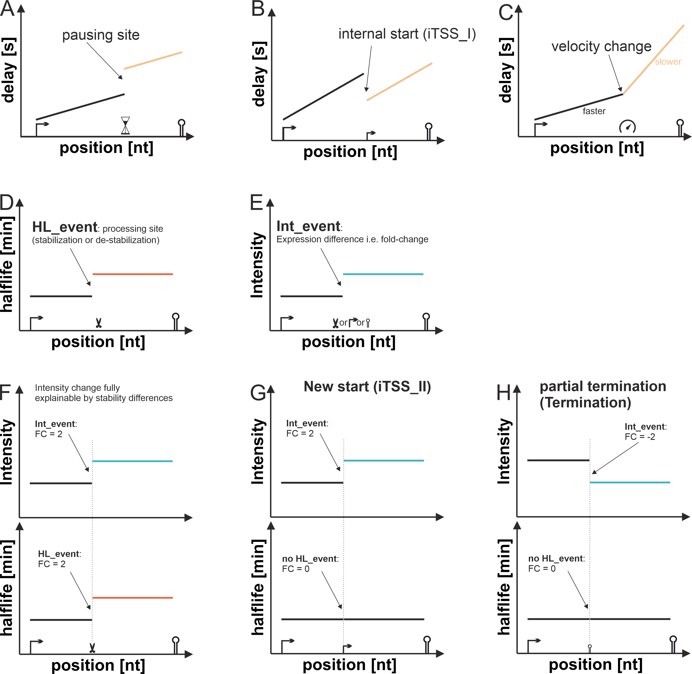
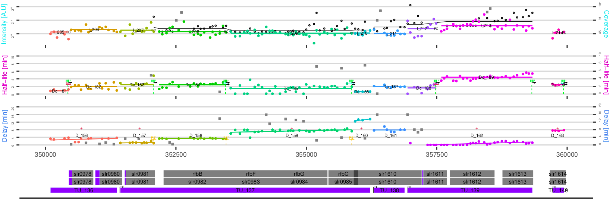
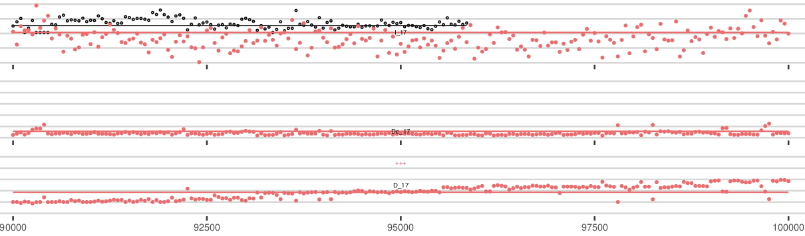
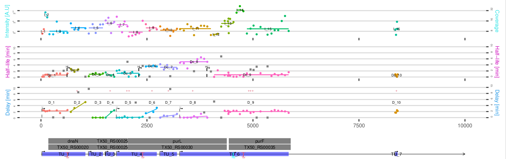
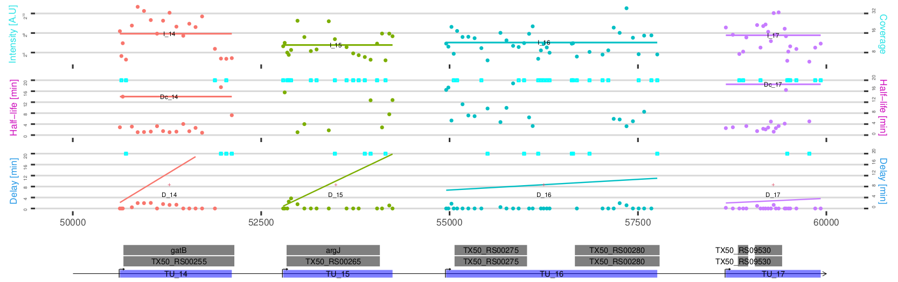

  
```{r, include=FALSE}
devtools::load_all(".")
```

```{r setup, include = FALSE}
knitr::opts_chunk$set(echo = TRUE,
                      message = TRUE,
                      warning = TRUE)
```

``` {r, echo = FALSE, message = FALSE}
require(rifi)
suppressPackageStartupMessages(library(SummarizedExperiment))
```


## 0. Installation

Please note that **'rifi'** is only available for Unix based systems. 
To install this package, start R (>= version "4.2") and enter: 

``` {r, eval = FALSE}
if (!requireNamespace("BiocManager", quietly = TRUE))
  install.packages("BiocManager")

BiocManager::install("rifi")
```

``` {r test, echo = FALSE}
```

## I. Introduction

The stability or halflife of bacterial transcripts is often estimated using 
Rifampicin timeseries data. Rifampicin has the special feature that it prevents the 
initiation of transcprition, but RNA polymerases which are already elongating are unaffected [@campbell_structural_2001].
This has the implication that the RNA concentrations of positions downstream of the transcriptional start site
appear unchanged until the last polymerase has passed this point. The result is a delayed exponential decay [@chen_genome-wide_2015], 
which can be fitted by the following model:

<br/>
$c(t,n) = \begin{cases} \frac{\alpha}{\lambda} & \quad \text{if } t < \frac{n}{v}\\
    \frac{\alpha}{\lambda} \times e^{-\lambda t} & \quad \text{if } t \geq \frac{n}{v}    \end{cases}$
<br/>

The model [@chen_genome-wide_2015] consists of
two phases; the firts phase describes the delay where the transcript concentration is in its
steady state defined by the ratio of the synthesis rate *$\alpha$* and the decay constant *$\lambda$* ($steadystate = \frac{\alpha}{\lambda}$). The 
delay is dependent on the distance from the transcriptional start site ***$n$*** and the transcription 
velocity ***$v$***. If the time after the Rifampicin additon is greater than the delay ($delay = \frac{n}{v}$)
the exponential decay phase starts.
<br/>

In addition to the standard model, we are using a second model which describes the behaviour at positions were the concentration ***increases*** after Rifampicin addition (Figure 1, right panel). This phenomenon can be explained by Rifampicin relievable transcription termination, e.g. through the transcriptional interference (TI) collision mechanism [@shearwin_transcriptional_2005] or termination by short-lived factors such as sRNAs [@wang_two-level_2015]. In the following we will call this model the 'TI model' which consists of three phases:

<br/>
$c(t,n) = \begin{cases} \frac{\alpha -  \alpha \times \beta}{\lambda} & \quad \text{if } t < \frac{n - n_{term}}{v}\\
\frac{\alpha}{\lambda} - \frac{\alpha \times  \beta}{\lambda} \times e ^{-\lambda (t -\frac{n - n_{term}}{v})} & \quad \text{if } \frac{n - n_{term}}{v} < t < \frac{n}{v}\\
(\frac{\alpha}{\lambda} -  \frac{\alpha \times \beta}{\lambda} \times e ^{-\lambda (t -\frac{n_{term}}{v})}) \times e^{-\lambda (t-\frac{n}{v})} & \quad \text{if }  \frac{n}{v} \leq t
    \end{cases}$
<br/>

The first phase describes again the steady state concentration at a given transcript position, but here the synthesis rate *$\alpha$* is reduced by the  **TI-termination-factor $\beta$**.
We assume a short lived factor responsible for the termination whose synthesis is stopped
after rifampicin addition. Thus after the relieve of termination all polymerases that start at the transcriptional start site can reach positions downstream of the former termination site ($n_{term}$), the time polymerases need from the position of termination to the position $n$ is delay for the increase ($delay_{increase}= \frac{n - n_{term}}{v}$).
After the last polymerase has passed the respective position, the exponential decay phase starts. 

**'rifi'** is a tool to do a stability analysis on high-throughput rifampicin data. RNA sequencing and microarray data derived from rifampicin treated bacteria with sufficiently high time resolution can reveal many insights into the mechanics of transcription, RNAP velocity and RNA stability. **'rifi'** is a tool for the holistic identification of these transcription processes.
The core part of the data analysis by rifi is the utilization of one of the two
non linear regression models applied on the time series data of each *probe* (or *bin*), giving the *probe/bin* specific delay, decay constant *$\lambda$* and half-life 
($t_\frac{1}{2} = \frac{\ln(2)}{\lambda}$) (Figure 1, left panel). 

<br/>
``` {r models, echo = FALSE, fig.cap = "**Fit models**. Fits from both models. Left: the two-phase standard fit. Right the TI model fits the increase in intensity. Black dotes represent the average intensity for each timepoint, colored circles indicate the respective replicate.", out.width = '100%'}
knitr::include_graphics("fit_models.png")
```
<br/>

After the fit of the individual *probes/bins*, common worklfows usually combine the 
individual **half-life** values based on the given genome annotation to get an 
average for the gene based stability. This procedure can not deal with differences 
within a given gene, e.g. due to processing sites. 'rifi' uses an annotation agnostic approach to get an unbiased estimate of individual transcripts as they actually appear *in vivo*. *probes/bins* with equal properties in the extracted values **delay**, **half-life**, **TI_termination_factor** and the given **intensity** values
are combined into segments by dynamic programming (called fragmentation in 'rifi'),
independent of an existing genome annotation (Figure 2). The fragmentation is performed hierarchically.  
Initially segments of bins are grouped by regions without significant sequencing
depth into **position_segments**. Those are grouped into **delay_fragments**
by common velocity. Subsequently, each delay-fragment is grouped by similar
half-life into **half_life_fragments**, on which the bins finally are grouped
into **intensity_fragments** by similar intensity. From the fragmentation, many
**events** can be extracted; **iTSS** (internal transcription start sites), transcription **pausing_sites**, **velocity_changes**,**processing_sites**, partial **terminations**, 
as well as instances of Rifampicin relievable transcription termination, e.g. 
by **TI** (transcription interference).
All data are integrated to give an estimate of continuous transcriptional units,
i.e. operons. Comprehensive output tables and visualizations of the full genome 
result and the individual fits for all *probes/bins* are produced.


<br/><br/>
``` {r hirarchy, echo = FALSE, fig.cap = "**Fragmentation hirarchy**. The hierarchy of the workflow is separated into five steps. At first segments are formed based on the distance to the next data point. The threshold is 200 nucleotides. Next, segments are parted into delay fragments. The delay fragments are parted by the half-life and likewise the half-life fragments are parted by intensity. Groups of TUs are formed based on the distance between the starts and ends of the delay fragments. Finally, within TUs, TI fragments are formed.", out.width = '100%'}
knitr::include_graphics("hirarchy3.png")
```
<br/>

### 1. Quickstart

If you have your data prepared as described in [The Input Data Frame]
(#the-input-data-frame) you can use the `rifi_wrapper` to run 'rifi" with 
default options. `rifi_wrapper` conveniently wraps all functions included in rifi.
That allows the user to run the whole workflow with one function. If the data 
contain a background component, e.g. in case of microarray data, take to define 
a meaningful background intensity. 

The functions used are:

  [`check_input`](#check_input)  
  [`rifi_preprocess`](#rifi_preprocess)  
  [`rifi_fit`](#rifi_fit)  
  [`rifi_penalties`](#rifi_penalties)  
  [`rifi_fragmentation`](#rifi_fragmentation)  
  [`rifi_stats`](#rifi_stats)  
  [`rifi_summary`](#rifi_summary)  
  [`rifi_visualization`](#rifi_visualization)
  
For `rifi_wrapper` you only need to provide the path to a **.gff** file of the 
respective genome and the input **SummarizedExperiment** object. The genome 
annotation is needed for the visualization and to map fragmented segments to 
annotated genes for an easier interpretation.
<br/><br/>
``` {r rifi_wrapper, eval = FALSE}
Path = gzfile(system.file("extdata", "gff_e_coli.gff3.gz", package = "rifi"))
wrapper_minimal <-
  rifi_wrapper(
    inp = example_input_e_coli,
    cores = 2,
    gff = Path,
    bg = 0,
    restr = 0.01
  )
}
```
<br/>
The wrapper saves the output of each sub-function in a list. Thus each intermediate 
result can be re-run with custom settings. the object 'wrapper_minimal' contains
only minimal artificial data to reduce the runtime of the test run. 

```{r, eval = TRUE}
data(wrapper_minimal)

# list of 6 SummarizedExperiment objects
length(wrapper_minimal)

#the first intermediate result
wrapper_minimal[[1]]
```
<br/>


### 2. The output

A small example output can be loaded with `data(summary_minimal)`. The final 
output is a **SummarizedExperiment** object. 

All main results are stored as metadata in the **SummarizedExperiment** object.
The first five entries are not of immediate importance.

```{r, eval = TRUE}
data(summary_minimal)

# the main results
names(metadata(summary_minimal))   
```

#### 1. *bin/probe* based results
Entry 6, **dataframe_summary_1**, contains all fit results for each individual
*bin/probe* and a mapping to the genome annotation. They can be exported to
an **.csv** file using `write.csv()`.

```{r, eval = TRUE}
# bin/probe probe based results
head(metadata(summary_minimal)$dataframe_summary_1)
```
```{r, eval = FALSE}
#export to csv
write.csv(metadata(summary_minimal)$dataframe_summary_1, file="filename.csv")
```

#### 2. **fragment** based results
Entry 7, **dataframe_summary_2**, contains all fit results for each 
**intensity_fragment**. Due to the hierachic fragmentation strategy [Figure 2]
several **intensity_fragment** (I_x) can belong to one **decay_fragment** (Dc_x),
one **delay_fragment** (D_x) and one transcriptional unit (TU_x).  The fragment
IDs can be used to locate the fragment in the output PDF file. The fragments are
mapped to the genome annotation and the mean halflife given in minutes and the
mean intensity is given with their standard deviations. 
Also the estimated velocity in nt/min is given. The table can be exported as
an **.csv** file using `write.csv()`.


```{r, eval = TRUE}
# all estimated fragments
metadata(summary_minimal)$dataframe_summary_2
```
```{r, eval = FALSE}
#export to csv
write.csv(metadata(summary_minimal)$dataframe_summary_2, file="filename.csv")
```

#### 3. Transcription **events**
Entry 8, **dataframe_summary_events**, contains all estimated transcriptional 
***events***. Events always appear between two transcript fragments.
<br/>
```{r, eval = TRUE}
# all estimated events
metadata(summary_minimal)$dataframe_summary_events
```
```{r, eval = FALSE}
#export to csv
write.csv(metadata(summary_minimal)$dataframe_summary_events, file="filename.csv")
```
<br/>
Changes in the linear increase of the delay indicate a potential **pausing site**
if there is a sudden delay increase (Figure 3A), a potential internal starting 
site **iTSS_I** if there is a sudden decrease in the delay (Figure 3B) and
a **velocity** change of the RNA polymerase if there is a slope change (Figure 3C). 
The events are statistically evaluated by Ancova ([apply_ancova](#apply_ancova))
or a t-test ([apply_Ttest_delay](#apply_Ttest_delay)).
<br/>
A fragment border between halflife segments (**HL_event**) which belong to the 
same transcriptional unit might indicate a processing site (Figure 3D) and a 
fragment border between intensity fragments (**Int_event**) (Figure 3E) can 
indicate a processing site (Figure 3F), a new transcriptional start site 
(**iTSS_II**) (Figure 3G) or an partial **termination** (Figure 3H), depending 
on the respective intensity foldchanges and the halflife foldchanges.
<br/>
Each **event** is described by is type, its p-Value and adjusted p-Value, 
the foldchange or event duration, the estimated event position, a mapping to 
existing annotations and the IDs of the two bordering fragments.

<br/>
``` {r events1, echo = FALSE, fig.cap = "Transcriptional events", out.width = '100%'}

```
The entries 9 to 11 contain specific subsets of events, i.e they are subsets of **dataframe_summary_events**.

#### 4. Rifampicin relievable termination - TI instances

Entry 12, **dataframe_summary_TI**, contains the identified instances of Rifampicin relievable termination, with termination factor, position and mapped annotation. **TI_fragments** are investigated independent of the delay/decay/intensity fragment hierarchy. A clear TI event should consist of two segments; a pre termination 
segment with a termination factor of ~0 and a post termination segment with a 
termination factor of >0. 

```{r, eval = TRUE}
# 
metadata(summary_minimal)$dataframe_summary_TI
```
```{r, eval = FALSE}
#export to csv
write.csv(metadata(summary_minimal)$dataframe_summary_TI, file="filename.csv")
```
<br/><br/>

#### 5. rowRanges

All fits and results for the individual *probes* or *bins* are also added as
additional columns to the rowRanges of the object. The data can be exported to
an **.csv** file.

```{r, eval = TRUE}

#the first 5 rows and 10/45 colums of the final rowRanges
rowRanges(summary_minimal)[1:5,1:10]

```
```{r, eval = FALSE}
#export to csv
write.csv(rowRanges(summary_minimal), file="filename.csv")

```

### 3. The whole genome visualization
<br/>

``` {r visua, echo = FALSE, fig.cap = "Whole genome visualization", fig.align = "left", out.height = "200%"}

```

<br/>
Example visualization of an Rifampicin microarray experiment from <i>Synechocystis</i> PCC6803. A segment of the forward strand with its GenBank annotation is shown. 
The first track shows the delay of the onset of the decay for the individual probes. The delay should be linearly increasing for continuous transcripts, which are clustered by dynamic programming and indicated by matching colors and a trendline. A sudden delay increase between two segments indicates a transcription polymerase pausing site (PS), while a sudden decrease indicates a new (internal) transcriptional start site (iTSS). The slope of the delay segment allows to estimate the speed of the RNA Polymerase. Changes in the velocity are indicated by a "V". 
The second track shows the fitted half-life of the probes and the clustered half-life segments. If two segments within the same transcriptional unit have different half-life (HL) a processing/stabilization site for one or the other segment can be assumed.
The third track shows the intensity and the intensity segments at timepoint 0 (before Rifampicin addition). If two segments within the same transcriptional unit have different intensities this (FC) this could be either due to a partial termination (Ter) or a new transcriptional start site (NS). 
Significant events are assigned with an '*'

### 4. Troubleshooting

#### 1. Fit

It is recommended to check the fit after running `rifi_fit`. If more than 30 % of the fits show a misfit, you may consider to check:

* Raw data

* Background

#### 2. Penalties

You may need to check your penalties if the last visualization shows:

##### 1. A high frequency of considerable long segments
<br/><br/>
``` {r longSegments, echo = FALSE, fig.cap = "**Long segments**", out.width="200%", out.height = "100%"}

```
<br/><br/>

##### 2. A high frequency of mini segments

In this case you may need to double check your data either the mini-segments are 
artifact of rifi or the data. The example below shows rather an artifact of
the data since the segmentation is hierarchical. The half-life and intensity 
segments are rather short because of the delay segmentation. 

<br/><br/>
``` {r miniSegments, echo=FALSE, fig.cap="**Mini segments**", out.width = '250%'}

```
<br/><br/>

##### 3. A high frequency of extreme high values
<br/><br/>
``` {r highValues, echo=FALSE, fig.cap="**High values**", out.width = '250%'}

```
<br/><br/>

* Absence of events in case you run big data.

* Absence of outliers.

### 5. Citing `rifi`

We hope you enjoy using `rifi`. Please cite the package in case of usage.
``` {r echo = FALSE}
citation("rifi")
``` 

## II. rifi_preprocess

The first step in the analysis of rifampicin time series data with rifi is
preprocessing. The three major steps are filtration (to get rid of artifacts or background datapoints), fitting the data to the
correct model (standard model or TI model) and merge the coefficients and the input data frame into one structure for the downstream process. The steps can be performed with five low level functions or the wrapper function `rifi_preprocess` (see section [`rifi_preprocess`] (#rifi_preprocess)).
The following paragraphs describe the sub-steps of `rifi_preprocess`. To 
directly read about the application or `rifi_preprocess` jump to section [`rifi_preprocess`] (#rifi_preprocess).

### 1. The Input Data Frame

The Input Data Frame is a SummarizedExperiment (SE) input format. SE structure 
as known includes the colData (description of each sample), assays (probes/bins intensity measurements), rowRanges(coordinates of probes/bin including probe
identifier and positions).
Rifi package includes two example SE: <em>*E.coli*</em> data from
RNAseq (data with replicates, input_df) [@dar_extensive_2018] and <em>*Synechocystis PCC 6803*</em>
data from microarrays (data with averaged replicates, see. "input_df").
<em>*E.coli*</em> is the input for this tutorial. In case of the <em>*E.coli*</em> 
RNAseq dataset the intensities are binned for every 50 nt. We recommend to use a similar
strategy if working with RNAseq data. The binning is not performed by 'rifi' and needs to be
done beforehand. 
Data from microarrays need to be checked carefully for background. We recommend
to run the workflow with low background e.g ~ 30 till `rifi_fit` and check the
probes fit to get an idea about the background level. The value estimated is
used to rerun rifi workflow.
<br/><br/>

``` {r echo = FALSE}
#example of E.coli data from RNAseq
paste("<font color='","red","'>","example of E.coli data from RNA-seq","</font>",sep="")
#print("example of E.coli data from RNA-seq")
data(example_input_minimal)
data(example_input_e_coli)
#require("SummarizedExperiment")
#columns with intensities measurements from all time point and replicates
print("assay e.coli")
assay(head(example_input_e_coli))
#rowRanges of the data
print("rowRanges e.coli")
rowRanges(head(example_input_e_coli))
# time points and replicates name
print("colData e.coli")
colData(example_input_e_coli)
```
<br/><br/>
``` {r echo = FALSE}
#example of Synechocystis data from microarrays
print("example of Synechocystis data from microarrays")
data(example_input_synechocystis_6803)
#columns with intensities measurements from all time point
print("assay synechocystis") 
assay(head(example_input_synechocystis_6803))
#rowRanges of the data
print("rowRanges synechocystis")
rowRanges(head(example_input_synechocystis_6803))
#time points
print("colData synechocystis")
colData(example_input_synechocystis_6803)
```
<br/>

The SE needs to comply to the following rules:

1. assays need to contains the intensities for the respective *probe* or *bin* need to be numeric. The first column
is called "0" and refers to the first time point (before rifampicin addition).
The intensities could contain 0 or NA except the column "0".
2. rowRanges includes two columns, "ID" and "position". Each ID in the column
"ID" refers to the same, unique strand/position combination. Thus, each 
replicate has to share the same ID. IDs could be either numeric (advised) or
character strings that do not contains "|","_" or ",".
3. colData contains 2 columns, timepoint and replicates.
4. metadata is optional.
<br/><br/>

### 2. `check_input`

Not complying to any of the rules will result in errors
and/or warnings by running "check_input": 
<br>
As our standard input contains probes that are not expressed and thus have a
relative intensity of 0 at time point 0, in our example check_input gives a
warning on which IDs have been removed, but the output can be safely used.  
The result contains the processed input data frame.  
<br/>
``` {r check_input, echo = FALSE}
probe <- check_input(inp = example_input_minimal, thrsh = 0)
```
<br/><br/>

### 3. `Filtration_Below_Background`
<br/>
At this point, a custom filtration function can be applied to remove replicates
that are below the background.

This is especially useful for microarrays data. We supply a function **filtration_below_backg**
that filters for background but retains replicates that show a promising pattern
even when they are below background. When a different custom function is applied
within `rifi_preprocess` the input variable x must refer to the intensity vector
over all timepoints. The output must be a character string containing **FLT**
for all replicates that should be filtered. Additional arguments must be hard
coded or given as default value, as additional arguments can not be passed into
`rifi_preprocess`.  

Application outside of `rifi_preprocess` can modify the 'filtration' column in
the input dataframe in any way, as that rows with replicates that should be
filtered contain the character string **FLT**.
The filtrated column would contain either("FLT", "_FLT_", "_FLT_your_text", 
NA, "_", "_passed_")
<br/><br/>

### 4. `make_df`
<br/>
`make_df` calculates the means of all replicates, excluding the filtered
replicates. Optionally, probes or bins, where all replicates are filtered can
be removed, when rm_FLT is set to TRUE (default is FALSE).
The column **probe_TI** is added to rowRanges for a later step, in which it is
decided which probes are fitted with the TI model (see [finding_TI](#finding_TI)).  
For microarray data, the probes with intensity of the latest time point does not
fall below the background are considered stables mRNA. Those probes are marked
in the **flag** column with the tag '_ABG_'("above background"). 'bg' is the
relative intensity threshold of the background. For RNAseq data the 'ABG'
sub-model is used and bg is set to 0, so that all probes are flagged as
'_ABG_'. The flag column is used to distribute different probes to the
different fitting models (see 7. finding_TI) The output of 'make_df' is the
probe based SE **probe_df**. At this stage, The rowRanges contain the columns
**ID**, **position**, and **intensity** (of time point 0) as mean of
all replicates from assay and the columns **probe_TI** and **flag**. 
For our tutorial bg is set to 0, because its RNAseq data, and rm_FLT
is TRUE to remove ID 18558 that we tagged with "FLT","_" and "_FLT_your_text".

<br/>
``` {r make_df, echo = TRUE}
probe <-
  make_df(
    inp = probe,
    cores = 2,
    bg = 0,
    rm_FLT = TRUE
  )
head(rowRanges(probe))
```
<br/><br/>

### 5. `segment_pos`

For the segmentation into **position-segments** by regions without significant
sequencing depth, `segment_pos` is called. This step is needed to enhance
performance of the program, since large position segments increase the
runtime.  
The size of the regions without significant sequencing depth (aka positions not
present in the rowRanges) or absence of probes is determined by the argument
**dist** (default is 300). Lower numbers create more, but smaller position
segments. Position segments are strand specific.
<br/><br/>
``` {r segment_pos, echo = TRUE}
probe <- segment_pos(inp = probe, dista = 300)
head(rowRanges(probe))
``` 
<br/><br/>

### 6. `finding_PDD`

Under the assumption of the standard model the RNA concentration should be 
the same over the whole length of the transcript, if the decay constant is unchanged
and no partial premature termination appears. A linear or exponential intensity 
decline indicates regions were something interesting happens. This could be in theory a decay by the
post transcription decay model (PDD) [@chen_genome-wide_2015], which is characterized by a linear decrease of
intensity by position. More likely is a fixed termination probability after each elongation step (exponential decrease), 
e.g. resulting from the collision mode of transcriptional interference.
`finding_PDD` flags potential candidates for post
transcription decay with "_PDD_". `finding_PDD` uses 'score_fun_linear'
function to make groups by the difference to the slope. The rowRanges contains
**ID**, **intensity**, **position** and **position_segment** columns.
`finding_PDD` needs additional parameters as **pen**, **pen_out** and **thrsh**

<br/><br/>
``` {r finding_PDD, eval = TRUE}
#Due to increased run time, this example is not evaluated in the vignette
probe <-
  finding_PDD(
    inp = probe,
    cores = 2,
    pen = 2,
    pen_out = 2,
    thrsh = 0.001
  )
head(rowRanges(probe))
``` 
<br/><br/>

### 7. `finding_TI`

As described in the [introduction](#i.-introduction) we want to indentify regions 
with a rifampicin relieved termination. Transcription interference (TI) is one
explanation of the rifampicin relieved termination. Here TI is used as a synonym for 
rifampicin relieved termination. `finding_TI` identifies regions of potential transcription interference (TI).
`finding_TI` uses `score_fun_ave` to make groups by the mean of "probe_TI". The
identified regions and a defined number of probes before the potential TI event
are flagged with '_TI_'. The identification is based on the probe_TI column,
which is a report for each probe, whether a later time point is higher in
relative intensity than the first time point. The rowRanges needs the columns
**ID**, **intensity**, **position** and **position_segment**. 
`finding_TI` needs additional parameters as **pen**, **thrsh** and **add**.
<br/><br/>
``` {r finding_TI, eval = TRUE}
#Due to increased run time, this example is not evaluated in the vignette
probe <-
  finding_TI(
    inp = probe,
    cores = 2,
    pen = 10,
    thrsh = 0.001
  )
head(rowRanges(probe))
``` 
<br/><br/>

### 8. `rifi_preprocess`

All preprocessing steps can be run with `rifi_preprocess` at once. This section
will focus on all possible arguments that can be passed to the function.

<br/><br/>
``` {r rifi_preprocess, echo = TRUE}
#From here on the examples are shown on minimal examples.
#Two bigger data sets can be used to run the example as well.
preprocess_minimal <-
  rifi_preprocess(
    inp = probe,
    cores = 2,
    bg = 0,
    rm_FLT = TRUE,
    thrsh_check = 10,
    dista = 300,
    run_PDD = TRUE
  )
head(rowRanges(preprocess_minimal))
```
<br/><br/>


## III. rifi_fit

`rifi_fit` wraps all fitting steps. The fitting functions fit the intensities
against the time series data. The first uses `nls2_fit` function to estimate
**delay**, **half-life**, **first time point intensity** and **background
intensity**. 
The second uses `TI_fit` function to estimate **delay** and **half-life** additionally to the **TI-termination-factor**.

The function used are:

  1.  `nls2_fit`
  2.  `TI_fit`
  3.  `plot_nls2`
  4.  `plot_singleProbe_function`
<br/><br/>

``` {r rifi_fit, echo = FALSE}
#Two bigger data sets can be used to run the example as well.
data(preprocess_minimal)
suppressWarnings(fit_minimal <- rifi_fit(
  inp = preprocess_minimal,
  cores = 2,
  viz = FALSE,
  restr = 0.2,
  decay = seq(.08, 0.11, by = .02),
  delay = seq(0, 10, by = .1),
  k = seq(0.1, 1, 0.2),
  bg = 0.2,
  TI_k = seq(0, 1, by = 0.5),
  TI_decay = c(0.05, 0.1, 0.2, 0.5, 0.6),
  TI = seq(0, 1, by = 0.5),
  TI_delay = seq(0, 2, by = 0.5),
  TI_rest_delay = seq(0, 2, by = 0.5),
  TI_bg = 0
))
```

<br/>
``` {r output_fit}
#Output
data(fit_e_coli)
head(rowRanges(fit_e_coli))
```


### 1. `nls2_fit`

`nls2_fit` function uses **nls2** function to fit a probe or bin using
intensities from different time point. **nls2** is able to use different
starting values using expand grid and select the best fit. The SE assays containing **intensity** of all timeserie and **ID** **intensity**, **position**, **probe_TI**, **flag** and **position_segment** columns from rowRanges are used as inputs (see below Table_2). `nls2_fit` function has two different models, one includes the background as parameter and estimates decay subtracting it. The other excludes the background coefficient and is applied for probes flagged with
***ABG***. All probes flagged with ***FLT*** are not fitted as they are below
background. Finally probes flagged with ***TI*** are fitted with TI model. The
output data is an extension of SE metaData, **delay** and **half-life**
coefficients are added (see below "head(probe)").

<br/><br/>
``` {r echo = TRUE,  eval = FALSE}
nls2_fit(inp = preprocess_minimal,
         cores = 1,
         decay = seq(.08, 0.11, by = .02),
         delay = seq(0, 10, by = .1),
         k = seq(0.1, 1, 0.2),
         bg = 0.2
)
```
<br/><br/>
``` {r echo = TRUE}
Table_2 <- rowRanges(preprocess_minimal)
head(Table_2)
```
<br/><br/>
``` {r echo = TRUE}
probe <- metadata(fit_minimal)[[3]]
head(probe)
```
<br/><br/>


### 2. `TI_fit`

`TI_fit` estimates transcription interference and termination factor using nls
function for probe or bin flagged as **TI**. It estimates the transcription
interference level (referred later to TI) as well as the transcription factor
fitting the probes/bins with nls function looping into several starting values.
To determine **TI** and **termination factor**, `TI_fit` function is applied to
the flagged probes and to the probes localized 200 nucleotides upstream. Before
applying `TI_fit` function, some probes/bins are filtered out if they are below
the background using `generic_filter_BG`. The model loops into a dataframe
containing sequences of starting values and the coefficients are extracted from
the fit with the lowest residuals. When many residuals are equal to 0, the
lowest residual can not be determined and the coefficients extracted could be
wrong. Therefore, a second filter was developed. First a loop is applied into
all starting values, nls objects are collected in tmp_v vector and the
corresponding residuals in tmp_r vector. The residuals are sorted and those non
equal to 0 are collected into a vector. If the first values are not equal to 0,
the best 20% of the list are collected in tmp_r_min vector and the minimum
termination factor is selected. On the other hand residuals between 0 to 20% of
the values collected in tmp_r_min vector are gathered. The minimum termination
factor coefficient is determined and stored. The coefficients are gathered in
res vector and saved as an object. The output data are additional columns in
SE rowRanges named **delay**, **half-life** and **TI_termination_factor** 
(see. "head(probe)").
<br/><br/>
``` {r TI_fit, eval = FALSE}
TI_fit(inp = preprocess_minimal,
       cores = 1,
       restr = 0.2,
       k = seq(0, 1, by = 0.5),
       decay = c(0.05, 0.1, 0.2, 0.5, 0.6),
       ti = seq(0, 1, by = 0.5),
       ti_delay = seq(0, 2, by = 0.5),
       rest_delay = seq(0, 2, by = 0.5),
       bg = 0
)
```
<br/><br/>
``` {r echo = TRUE}
probe <- metadata(fit_minimal)[[4]]
head(probe)
```
<br/><br/>

### 3. `plot_nls2`

`plot_nls2` plots the fit from nls2 with the corresponding coefficients,
**delay** and **decay**. **delay** is indicated on the x-axis and **half_life**
is calculated from ln2/decay. The output is shown on nls2Plot figure.
<br/><br/>
``` {r plot_nls2, eval=F}
plot_nls2_function(inp = probe_df)
```
<br/><br/>
``` {r nls2Plot, echo=FALSE, fig.cap="**Standard fit with nls2**", out.width = '100%'}
knitr::include_graphics("nls2Plot.png")
```
<br/><br/>

`plot_nls2` also plots the fit from TI with the corresponding coefficients,
**delay**, **ti_delay**, **half_life**, **TI_termination_factor** and
**TI**. Additional parameters are included on the legend a, the output is shown
on TIPlot figure.
<br/><br/>
``` {r plot_nls2_function, eval=F}
plot_nls2_function(inp = probe_df)
```
<br/><br/>
``` {r TIPlot, echo = FALSE, fig.cap="**TI model fit**", out.width = '100%'}
knitr::include_graphics("TIPlot.png")
```
<br/><br/>

## IV. rifi penalties

'rifi' uses dynamic programming to combine *probes/bins* with equal properties 
in the extracted values into segments (called fragmentation in 'rifi'). The penalties define the specificity and sensitivity of the fragmentation. Higher penalties will result in less segments, i.e. a lower sensitivity but a higher specificity and vice versa. For convenience 'rifi' provides an automatic method which tries to maximize the correct segment splits and to minimize the wrong splits using statistics. The result can be best investigated in the final visualization. If needed the penalties can be manually adapted.

`rifi_penalties` wraps all penalty steps, wraps the functions: `make_pen` and
`viz_pen_obj.` For use of this wrapper jump to [`rifi_penalties`](#rifi_penalties)

### 1. `make_pen`

`make_pen` calls one of four available penalty functions to automatically assign
penalties for the dynamic programming. Four functions are called:

1.  `fragment_delay_pen`

2.  `fragment_HL_pen`

3.  `fragment_inty_pen`

4.  `fragment_TI_pen`

These functions return the amount of statistically correct and statistically
wrong splits at a specific pair of penalties. 'make_pen' iterates over many
penalty pairs and picks the most suitable pair based on the difference between
wrong and correct splits. The sample size, penalty range and resolution as well
as the number of cycles can be customized. The primary start parameters create a
matrix with n = rez_pen rows and n = rez_pen_out columns with values between
sta_pen/sta_pen_out and end_pen/end_pen_out. The best penalty pair is
picked. If dept is bigger than 1 the same process is repeated with a new matrix
of the same size based on the result of the previous cycle. Only position
segments with length within the sample size range are considered for the
penalties to increase run time. ALso, outlier penalties cannot be smaller
than 40% of the respective penalty. `make_pen` returns a penalty object (list
of 4 objects) the first being the logbook.

<br/><br/>
``` {r make_pen, eval = FALSE}
data(fit_minimal)
pen_delay <-
  make_pen(
    probe = fit_minimal,
    FUN = rifi:::fragment_delay_pen,
    cores = 2,
    logs = logbook,
    dpt = 1,
    smpl_min = 0,
    smpl_max = 18,
    sta_pen = 0.5,
    end_pen = 4.5,
    rez_pen = 9,
    sta_pen_out = 0.5,
    end_pen_out = 3.5,
    rez_pen_out = 7
  )
pen_HL <- make_pen(
  probe = fit_minimal,
  FUN = rifi:::fragment_HL_pen,
  cores = 2,
  logs = logbook,
  dpt = 1,
  smpl_min = 0,
  smpl_max = 18,
  sta_pen = 0.5,
  end_pen = 4.5,
  rez_pen = 9,
  sta_pen_out = 0.5,
  end_pen_out = 3.5,
  rez_pen_out = 7
)
pen_inty <-
  make_pen(
    probe = fit_minimal,
    FUN = rifi:::fragment_inty_pen,
    cores = 2,
    logs = logbook,
    dpt = 1,
    smpl_min = 0,
    smpl_max = 18,
    sta_pen = 0.5,
    end_pen = 4.5,
    rez_pen = 9,
    sta_pen_out = 0.5,
    end_pen_out = 3.5,
    rez_pen_out = 7
  )
pen_TI <- make_pen(
  probe = fit_minimal,
  FUN = rifi:::fragment_TI_pen,
  cores = 2,
  logs = logbook,
  dpt = 1,
  smpl_min = 0,
  smpl_max = 18,
  sta_pen = 0.5,
  end_pen = 4.5,
  rez_pen = 9,
  sta_pen_out = 0.5,
  end_pen_out = 3.5,
  rez_pen_out = 7
)
```
<br/><br/>

#### 1. `fragment_delay_pen`

`fragment_delay_pen` is called by `make_pen` function to automatically assign
penalties for the dynamic programming of delay fragment. The function used for
`fragment_delay_pen` is `score_fun_linear`. `score_fun_linear` scores the values
of y on how close they are to a linear fit, for more details check
`functions_scoring.r`.
<br/><br/>

#### 2. `fragment_HL_pen`

`fragment_HL_pen` is called by `make_pen` function to automatically assign
penalties for the dynamic programming of half-life fragments. The function used for
`fragment_HL_pen` is `score_fun_ave`. `score_fun_ave` scores the values of y on
how close they are to the mean, for more details check 'functions_scoring.r'.
<br/><br/>

#### 3. `fragment_inty_pen`

`fragment_inty_pen` is called by `make_pen` function to automatically assign
penalties for the dynamic programming of intensity fragments. The function used for
`fragment_inty_pen` is `score_fun_ave`. `score_fun_ave` scores the values of y
on how close they are to the mean, for more details check
'functions_scoring.r'.
<br/><br/>

#### 4. `fragment_TI_pen`

`fragment_TI_pen` is called by `make_pen` function to automatically assign
penalties for the dynamic programming of TI fragments. The function used for
`fragment_TI_pen` is `score_fun_ave`. `score_fun_ave` scores the values of y on
how close they are to the mean, for more details check 'functions_scoring.r'.
<br/>

### 2. `viz_pen_obj`

`viz_pen_obj` an optional visualization of any penalty object created by
make_pen and can be customized to show only the n = top_i top results. Results
are ranked from worst to best for correct-wrong ratio, and color coded by
penalty, while the outlier-penalty is given as a number for each point. Red and
green dots represent the wrong and correct splits respectively.

<br/><br/>
``` {r viz_pen_obj, eval = FALSE}
viz_pen_obj(obj = pen_delay, top_i = 10)
```
<br/><br/>
``` {r penalty, echo = FALSE, fig.cap = "**penalty plot**: The graphic shows penalties ranked by the correct fits subtracted by the wrong fits. Each penalty corresponds to a color given in the legend. Red dots represent wrong splits, green dots represent correct splits. In the zoomed window (bottom) numbers above the dots represent the outlier-penalty.", out.width = '100%'}
knitr::include_graphics("penalty.png")
```

<br/>

### 3. `rifi_penalties`
<br/><br/>
``` {r rifi_penalties, echo=F}
data(fit_minimal)
penalties_minimal <-
  rifi_penalties(
    inp = fit_minimal,
    details = TRUE,
    viz = FALSE,
    top_i = 25,
    cores = 2,
    dpt = 1,
    smpl_min = 10, 
    smpl_max = 100,
    sta_pen = 0.5,
    end_pen = 4.5, 
    rez_pen = 9, 
    sta_pen_out = 0.5, 
    end_pen_out = 4.5,
    rez_pen_out = 9
  )
```
<br/><br/>
``` {r output_penalties}
#The output
data(penalties_e_coli)
head(rowRanges(penalties_e_coli))
```
<br/><br/>

## V. rifi fragmentation

`rifi_fragmentation` conveniently wraps all fragmentation steps, wraps the
functions: `fragment_delay`, `fragment_HL`, `fragment_inty`, `TUgether` and
`fragment_TI`.
<br/>
The functions called are:

1.  `fragment_delay`
2.  `fragment_HL`
3.  `fragment_inty`
4.  `fragment_TI`
5.  `TUgether`

<br/><br/>
``` {r rifi_fragmentation, echo=F}
data(penalties_minimal)
fragmentation_minimal <-
  rifi_fragmentation(
    inp = penalties_minimal,
    cores = 2
  )
```
<br/><br/>
``` {r echo = TRUE}
data(fragmentation_e_coli)
head(rowRanges(fragmentation_e_coli))
```
<br/><br/>

### 1. `fragment_delay`

`fragment_delay` makes delay_fragments based on position_segments and assigns
all gathered information to the probe based data frame. The columns
"delay_fragment", "velocity_fragment", "intercept" and "slope" are added.
`fragment_delay` makes delay_fragments, assigns slopes, velocity (1/slope) and
intercepts for the TU calculation.
<br/><br/>
The function used are:

   `score_fun_linear`

`score_fun_linear` is the score function used by dynamic programming for delay
fragmentation, for more details, see below.
<br/><br/>
``` {r fragment_delay, eval = FALSE}
data(fragmentation_minimal)
data(penalties_minimal)
probe_df <- fragment_delay(
  inp = fragmentation_minimal,
  cores = 2,
  pen = penalties_minimal["delay_penalty"],
  pen_out = penalties_minimal["delay_outlier_penalty"]
)
head(rowRanges(probe_df))
```
<br/><br/>

### 2. `fragment_HL`

`fragment_HL` performs the half_life fragmentation based on delay_fragments
and assigns all gathered information to the probe based data frame. The columns
"HL_fragment" and "HL_mean_fragment" are added to rowRanges(SE). `fragment_HL`
makes half-life_fragments and assigns the mean of each fragment.
<br/><br/>
The function used is:

   `score_fun_ave`

`score_fun_ave` is the score function used by dynamic programming for half-life
fragmentation, for more details, see below.
<br/><br/>
``` {r fragment_HL, eval = FALSE}
data(fragmentation_minimal)
data(penalties_minimal)
probe_df <- fragment_HL(
  probe = fragmentation_minimal,
  cores = 2,
  pen = penalties_minimal["half_life_penalty"],
  pen_out = penalties_minimal["half_life_outlier_penalty"]
)
head(rowRanges(probe_df))
```

<br/><br/>

### 3. `fragment_inty`

`fragment_inty` performs the intensity fragmentation based on HL_fragments and
assigns all gathered information to the probe based data frame. The columns
"intensity_fragment" and "intensity_mean_fragment" are added rowRanges(SE). 
`fragment_inty` makes intensity_fragments and assigns the mean of each fragment.
<br/><br/>
The function used is:

   `score_fun_ave`

`score_fun_ave` is the score function used by dynamic programming for intensity
fragmentation, for more details, see below.
<br/><br/>
``` {r fragment_inty, eval = FALSE}
data(fragmentation_minimal)
data(penalties_minimal)
probe_df <- fragment_inty(
  inp = fragmentation_minimal, 
  cores = 2,
  pen = penalties_minimal["intensity_penalty"],
  pen_out = penalties_minimal["intensity_outlier_penalty"]
)
head(rowRanges(probe_df))
```
<br/><br/>

### 4. `TUgether`

`TUgether` combines delay fragments into TUs and adds a new column "TU" to 
rowRanges(SE).

The function used is:

   `score_fun_increasing`

`score_fun_increasing` is the score function used by dynamic programming for
`TUgether`, for more details, see below.
<br/><br/>
``` {r TUgether, eval = FALSE}
data(fragmentation_minimal)
probe_df <- TUgether(inp = fragmentation_minimal, cores = 2, pen = -0.75)
head(rowRanges(probe_df))
```
<br/><br/>

### 5. `fragment_TI`

`fragment_TI` performs the TI fragmentation based on TUs and assigns all
gathered information to the probe based SE. The columns
"TI_termination_fragment" and "TI_mean_termination_factor" are added to
rowRanges(SE). `fragment_TI` makes TI_fragments and assigns the mean of each
fragment.

The function used are:

   `score_fun_ave`

`score_fun_ave` is the score function used by dynamic programming for TI
fragmentation, for more details, see below.

<br/><br/>
``` {r fragment_TI, eval = FALSE}
data(fragmentation_minimal)
data(penalties_minimal)
probe_df <- fragment_TI(
  inp = fragmentation_minimal,
  cores = 2,
  pen = penalties_minimal["TI_penalty"],
  pen_out = penalties_minimal["TI_outlier_penalty"]
)
head(rowRanges(probe_df))
```
<br/><br/>

## VI. rifi_stats

`rifi_stats` wraps all statistical prediction steps.

The function wrapped are:

1.  `predict_ps_itss`
2.  `apply_Ttest_delay`
3.  `apply_ancova`
4.  `apply_event_position`
5.  `apply_t_test`
6.  `fold_change`
7.  `apply_manova`
8.  `apply_t_test_ti`
9.  `gff3_preprocess`

<br/><br/>
``` {r rifi_stats}
data(fragmentation_minimal)
Path = gzfile(system.file("extdata", "gff_e_coli.gff3.gz", package = "rifi"))
stats_minimal <- rifi_stats(inp = fragmentation_minimal, dista = 300, 
                            path = Path)
head(rowRanges(stats_minimal))
```
<br/>

### 1. `predict_ps_itss`

`predict_ps_itss` predicts pausing sites **ps** and internal starting sites
**iTSS_I** between delay fragments within the same TU. `predict_ps_itss`
compares the neighboring delay segments to each other by positioning the
intercept of the second segment into the first segment using slope and intercept
coefficients.
`predict_ps_itss` selects unique TUs, delay fragments, slope, velocity fragment
and intercept. It loops into all delay segments and estimate the coordinates of
the last point of the first segment using the coefficients of the second segment
and vice versa. The difference between the predicted positions is compared to
the threshold. In case the strand is "-", the positions of both segments are
ordered from the last position to the first one. All positions are merged into
one column and subtracted from the maximum position. The column is split in 2,
the first and second correspond to the positions of the first and second
segments respectively. Both segments are subsequently subjected to lm fit and
the positions predicted are used on the same way as on the opposite strand. The
difference between the predicted positions is compared to the negative
threshold, **ps** is assigned otherwise, and if the difference is higher than
the positive threshold, **iTSS_I** is assigned. The event duration is 
additionally added.
<br/><br/>
``` {r predict_ps_itss, eval=FALSE}
data(fragmentation_minimal)
probe <- predict_ps_itss(inp = fragmentation_minimal, maxDis = 300)
head(rowRanges(probe))
```

<br/><br/>

### 2. `apply_Ttest_delay`

`apply_Ttest_delay` uses `t-test` to check the significance of the points
between 2 segments showing pausing site **ps** and internal starting site
**iTSS_I** independently. 
`apply_Ttest_delay` selects the last point from the first segment and the first
point from the second segment and added them to the residuals of each model,
the sum is subjected to `t-test`.
<br/><br/>
``` {r apply_Ttest_delay, eval = FALSE}
probe <- apply_Ttest_delay(inp = probe)
head(rowRanges(probe))
```

<br/><br/>

### 3. `apply_ancova`

`apply_ancova` uses `ancova` to check the slope significance between two delay
fragments showing either pausing site (ps) or internal starting site (ITSS_I).
`apply_ancova` brings both fragments to the same position and apply `ancova`
test.
<br/><br/>
``` {r apply_ancova, eval=F}
probe <- apply_ancova(inp = probe)
head(rowRanges(probe))
```

<br/><br/>

### 4. `apply_event_position`

`apply_event_position` extract the position between 2 segments with pausing site
or iTSS_I event.
<br/><br/>
``` {r apply_event_position, eval=F}
probe <- apply_event_position(inp = probe)
head(rowRanges(probe))
```
<br/>

### 5. `apply_t_test`

`apply_t_test` uses the statistical `t_test` to check if the fold-change of
half-life (HL) fragments and the fold-change intensity fragments respectively is
significant. `apply_t_test` compares the mean of two neighboring fragments
within the same TU to check if the fold-change is significant. Fragments with
distance above threshold are not subjected to t-test.
<br/><br/>
The functions used are:

1.  `fragment_function`
2.  `t_test_function`

#### 1. `fragment_function`

`fragment_function` checks number of fragments inside TU, only fragments above 2
are gathered for analysis.

#### 2. `t_test_function`

`t_test_function` makes fold-change and apply t-test, assign fragments names and
ratio, add columns with the corresponding p_values.
<br/><br/>
``` {r apply_t_test, eval=F}
probe <- apply_t_test(inp = probe, threshold = 300)
head(rowRanges(probe))
```

<br/><br/>

### 6. `fold_change`

`fold_change` sets a fold-change ratio between the neighboring fragments of
Half_life (HL) and intensity of two successive fragments. Two intensity
fragments could belong to one HL fragment therefore the function sets first the
borders using the position and applies the fold-change ratio between the
neighboring fragments of HL and those from intensity ((half-life frgB / 
half-life frgA) / (intensity frgB/intensity frgA)). All grepped fragments are
from the same TU excluding outliers.

The function used is:

`synthesis_r_Function`

`synthesis_r_Function` assigns events depending on the ratio between HL and
intensity of two consecutive fragments. Intensity (int) in steady state is
equivalent to synthesis rate(k)/decay(deg).

1.  int = k/deg

2.  int1/int2 = k1/deg1 * deg2/k2

3.  The synthesis ratio is equivalent to: int1 * (deg1/int2) * deg2 = k1/k2

Comparing the synthesis ratio to threshold, an event is assigned:

a. synthesis ratio > 1 -> New start
b. synthesis ratio < 1 -> Termination
c. synthesis ratio = 1 -> No change in synthesis rate
<br/><br/>
``` {r fold_change, eval=F}
probe <- fold_change(inp = probe)
head(rowRanges(probe))
```
<br/>

### 7. `apply_manova`

`apply_manova` checks if the ratio of HL ratio and intensity ratio is
statistically significant. `apply_manova` compares the variance between two
fold-changes, Half-life and intensity within the same TU ((half-life frgB / 
half-life frgA) / (intensity frgB/intensity frgA)). One half-life fragment could cover two intensity fragments therefore the fragments borders should be set first.

the function used is:

`manova_function`

`manova_function` checks the variance between 2 segments (independent variables)
and two dependents variables (HL and intensity). The dataframe template is
depicted below. The lm fit is applied and p_value is extracted.
<br/><br/>
``` {r apply_manova, eval=F}
apply_manova(inp = probe)
head(rowRanges(probe))
```
<br/>

### 8. `apply_t_test_ti`

`apply_t_test_ti` compares the mean of two neighboring TI fragments within the
same TU using the statistical t_test to check if two neighboring TI fragments
are significant. `apply_t_test_ti` selects TI fragments within the same TU
excluding the outliers. Two new columns are added, "ti_fragments" and
"p_value_tiTest" referring to TI fragments subjected to t-test and their
p_value.


### 9. `gff3_preprocess`

`gff3_preprocess` processes gff3 file from database, extracting gene names and
locus_tag from all coding regions (CDS). Other features like UTRs, ncRNA, asRNA
ect.. are extracted if available on one hand and the genome length on other
hand. The output is a list of 2 elements and added to the input as metadata.

The output data frame from `gff3_preprocess` function contains the following
columns:

a. *region*: CDS or any other available like UTRs, ncRNA, asRNA
b. *start*: start position of the gene
c. *end*: end position of the gene
d. *strand*: +/-
e. *gene*: gene annotation if available otherwise locus_tag annotation replaces
it
f. *locus_tag*: locus_tag annotation

<br/><br/>
``` {r gff3_preprocess, eval = FALSE}
Path = gzfile(system.file("extdata", "gff_e_coli.gff3.gz", package = "rifi"))
  metadata(stats_minimal)$annot <- gff3_preprocess(path = Path)
```
<br/>

**path** path: path to the directory containing the gff3 file

<br/><br/>
``` {r apply_t_test_ti, eval=F}
probe <- apply_t_test_ti(inp = probe)
head(rowRanges(probe))
```
<br/>


## VII. rifi_summary

`rifi_summary` wraps and summarizes all rifi outputs into different tables in a
compact form. The tables connect rifi output and genes annotation. Four tables
are generated and gathered as metadata into SE.

The functions used are:

1. `event_dataframe`
2. `dataframe_summary`
3. `dataframe_summary_events`
4. `dataframe_summary_events_HL_int`
5. `dataframe_summary_events_ps_itss`
6. `dataframe_summary_events_velocity`
7. `dataframe_summary_TI`

<br/><br/>
``` {r rifi_summary, eval=F}
data(stats_minimal)
summary_minimal <- rifi_summary(stats_minimal)
```
<br/><br/>
```{r, eval = FALSE}
data(summary_minimal)
head(metadata(summary_minimal))
```
<br/><br/>


### 1. `event_dataframe`

`event_dataframe` creates a data frame only with events for segments and genes.
`event_dataframe` selects columns with statistical features in addition to "ID",
"position" and "TU" columns. The data frame combines fragments, events and statistical test and the corresponding genes. The column are:

   **region**: feature of the genome e.g. CD, ncRNA, 5'UTR ect....

   **gene**: gene annotation

   **locus_tag**: locus tag annotation

   **strand**: strand if data is stranded

   **TU**: TU annotation

   **position**: position on the genome

   **FC_fragment_intensity**: The intensity fragments subjected to fold change

   **FC_intensity**: fold change of two intensity fragments

   **p_value_intensity**: p_value of the fold change of two intensity fragments

   **FC_fragment_HL**: The halflife fragments subjected to fold change

   **FC_HL**: fold change of two HL fragments

   **p_value_HL**: p_value of the fold change of two HL fragments

   **FC_HL_intensity_fragment**: The fragments subjected to ratio of
    fold-change of two intensity fragments and the two half-life fragments

   **FC_HL_intensity**: ratio of fold-change of two intensity fragments and
    the two half-life fragments

   **FC_int_adapted**: fold change of two intensity fragments

   **FC_HL_adapted**: fold change of two HL fragments adapted to the
    intensity fragments

   **p_value_Manova**: p_value of the statistical test Manova applied to
    FC_HL_intensity

   **synthesis_ratio**: ratio of FC_HL_intensity

   **synthesis_ratio_event**: event related to ratio

   **pausing_site**: presence or absence of ps is indicated by +/-

   **ITSS_I**: presence or absence of ITSS_I is indicated by +/-

   **event_ps_itss_p_value_Ttest**: p_value of the t-test applied to ps and
   iTSS_I.

   **ps_ts_fragment**: The fragments subjected to ps and iTSS_I

   **event_position**: event position

   **delay**: delay coefficient extracted from the fit

   **half_life**: half-life coefficient extracted from the fit

   **intensity**: intensity coefficient extracted from the fit
   
<br/><br/>
``` {r event_dataframe, eval=F}
data(stats_minimal)
event_dataframe(data = stats_minimal, data_annotation = metadata(stats_minimal)$annot[[1]])
```
<br/>

   **probe** data frame: the probe based data frame
   
   **data_annotation** data frame: the coordinates extracted from gff3 file
<br/><br/>

The function used are:

1.  `position_function`

2.  `annotation_function_event`

3.  `strand_function`

#### 1. `position_function`

`position_function` adds the specific position of pausing sites and iTSS_I
events.

#### 2. `annotation_function_event`

`annotation_function_event` adds the events to the annotated genes. 

#### 3. `strand_function`

`strand_function` used by `annotation_function_event` function in case of
stranded data.

### 2. `dataframe_summary`

`dataframe_summary` creates two tables summary of segments relating gene
annotation to fragments. `dataframe_summary` creates two tables summary of
segments and their half-lives. The first output is bin/probe features and the
second one is intensity fragment based. Both tables are added as metaData.
<br/><br/>

### 3. `dataframe_summary_events`

`dataframe_summary_events` creates one table relating gene annotation to all
events. The events are assigned on the first column. The table is added as
metaData.
<br/><br/> 
 
### 4. `dataframe_summary_events_HL_int`

`dataframe_summary_events_HL_int` creates one table relating gene annotation to
all termination and new starting sites detected from half_life and intensity
ratios. The events are assigned on the first column. The table is added as
metaData.
<br/><br/>

### 5. `dataframe_summary_events_ps_itss` 

`dataframe_summary_events_ps_itss`  creates one table relating gene annotation
with pausing sites and internal starting sites events detected from delay
fragments. The events are assigned on the first column. The table is added as
metaData.
<br/><br/>

### 6. `dataframe_summary_events_velocity`

`dataframe_summary_events_velocity`  creates one table relating gene annotation
with velocity ration detected from delay fragments. The events are assigned
on the first column. The table is added as metaData.
<br/><br/>

### 7. `dataframe_summary_TI`

`dataframe_summary_TI` creates one table relating gene annotation to
transcription interference. The table is added as metaData.
<br/><br/>

## VIII. rifi_visualization

`rifi_visualization` plots the whole genome with genes, transcription units
(TUs), delay, half-life (HL), intensity fragments features, events, velocity,
annotation, coverage if available. The function plots all annotation features
including genes, as-RNA, ncRNA, 5/3'UTR if available and TUs as segments.
`rifi_visualization` plots delay, HL and intensity fragments with statistical
t-test between the neighboring fragment, significant t-tests are assigned with
'*'. The events are also indicated with asterisks if p_value is significant.

The functions used are:

   `gff3_preprocess`: see `rifi_stats` section
   
   `strand_selection`: check if data is stranded and arrange by position
   
   `splitGenome_function`: splits the genome into fragments
   
   `indice_function`: assign a new column to the data to distinguish between
    fragments, outliers and terminals from delay, HL and intensity
    
   `TU_annotation`: designs the segments border for the genes and TUs
    annotation
    
   `gene_annot_function`: requires gff3 file, returns a dataframe adjusting
    each fragment according to the annotation. It allows the plot of genes and
    TUs shared in two pages
    
   `label_log2_function`: adds log scale to intensity values
   
   `label_square_function`: adds square scale to coverage values
   
   `coverage_function`: the function is used only in case of coverage is
    available
    
   `secondaryAxis`: adjusts the halflife or delay to 20 in case of the
    dataframe row numbers is equal to 1 and the halflife or delay exceed the
    limit, they are plotted with different shape and color
    
   `outlier_plot`: plot the outliers with half-life between 10 and 30 on the
    maximum of the yaxis
    
   `add_genomeBorders`: resolves the issue when the annotated genes are on the
    borders and can not be plotted. The function splits the region in 2 adding
    the row corresponding to the split part to the next page except for the
    first page
    
   `my_arrow`: creates an arrow for the annotation
   
   `arrange_byGroup`: selects the last row for each segment and add 40
    nucleotides in case of negative strand for a nice plot
    
   `regr`: plots the predicted delay from linear regression. If data is
    stranded (strand==1) and if the data is on negative strand
    
   `meanPosition`: assign a mean position for the plot
   
   `delay_mean`: adds a column in case of velocity is NA or equal to 60. The
    mean of the delay is calculated excluding terminals and outliers

   `my_segment_T`: plots terminals and pausing sites labels

   `my_segment_NS`: plots internal starting sites 'iTSS'

   `min_value`: returns minimum value for event plots in intensity plot

   `velocity_fun`: function to plot velocity

   `limit_function`: for values above 10 or 20 in delay and hl, Limit of the
    axis is set differently. yaxis limit is applied only if 3 values above 10
    and lower or equal to 20 are present. An exception is added in case a
    dataframe has less than 3 rows and 1 or more values are above 10, the rest
    of the values above 20 are adjusted to 20 on `secondaryAxis` function

   `empty_boxes`: used only in case the dataframe from the positive strand is
    not empty, the TU are annotated

   `function_TU_arrow`: avoids plotting arrows when a TU is split into two
    pages

   `terminal_plot_lm`: draws a linear regression line when terminal outliers
    have an intensity above a certain threshold and are consecutive. Usually are
    smallRNA (ncRNA, asRNA)

   `slope_function`: replaces slope lower than 0.0009 to 0

   `velo_function`: replaces infinite velocity with NA

   `TI_frag_threshold`: splits the TI fragments on the same TI event
   
<br/><br/>

``` {r rifi_visualization, eval = FALSE}
stats_minimal
rifi_visualization(
  data = stats_minimal
  )
```
<br/><br/>
```{r genomeplot1, echo=F, fig.cap="**Fragments Plot Forward Strand**", out.width = '100%'}
	knitr::include_graphics("genome_plot_1.png")
```
<br/><br/>

``` {r genomeplot2, echo=F, fig.cap="**Fragments Plot Reverse Strand**", out.width = '100%'}
	knitr::include_graphics("genome_plot_2.png")
```
<br/>
The plot is located on vignette "genome_fragments.pdf" and shows 4 sections: 
annotation, delay, half-life and intensity.

### 1. Annotation

   **TU**: Transcription unit annotation from Rifi workflow

   **Locus tag**: Locus_tag annotation from genome annotation

   **gene**: gene annotation from genome annotation. If gene annotation is not
   available, locus_tag is given instead

### 2. Delay

   **Delay**: Delay fragments, fragments annotation, "+/++/+++" indicates
   velocity degree, events are indicated by "PS" or "iTSS", "*" indicates
   significant statistical test

### 3. Half-life

   **Half-life**: HL fragments, fragments annotation, events like termination
   and iTTS_II are indicated by "Ter" or "NS"; "*" indicates significant
   statistical test for HL fold change

### 4. Intensity/coverage

   **Intensity**: Intensity fragments, fragments annotation, "*" indicates
    significant statistical test for intensity fold change. An additional black
    line above the fragments indicate the mean of TI factor for each fragment
    and dots indicate TI factor for each bin. Dot vertical green lines shows TI
    fragments, "Tinterf(*)" indicate significant statistical test between
    fragments
    
   **Coverage**: In case of available coverage, it could be plotted on the same
    section as intensity

### 5. Additional features

   **outliers**: are indicated by square shape an grey color
    
   **high values**: are indicated by square shape an cyan color
   
<br/><br/>


## IX. Additional functions

1.  `score_fun_linear`

2.  `score_fun_ave`

3.  `score_fun_increasing`

All these 3 functions are using the dynamic programming approach to part a
sequence of continuous points into fragments. It uses three principles steps:

1.  iteration through values applying a function.
2.  storing the values and their IDs.
3.  selecting for the minimum or the maximum score according to the objective.
4.  in case of the first 2 functions, the outliers are extracted.
 
### 1. `score_fun_linear`

`score_fun_linear` scores the residuals from a linear fit. `score_fun_linear`
fits a regression line from a vector of minimum 3 values **y**, a vector of
positions **x**. The IDs **z** and the sum of residuals are stored. A new value
y and x is added, the fit is performed and the new IDs and sum of residuals are
stored. After several fits, the minimum score and the corresponding IDs is
selected and stored as the best fragment. In case of the slope is bigger
as 1/60, the residuals are calculated as if the slope was 1/60. In case of the
stranded option is inactive and the slope is smaller as -1/60 the residuals are
calculated as if the slope was -1/60. In both cases, the velocity is limited
to 1 nucleotide per second. `score_fun_linear` selects simultaneously for
outliers, the maximum number is fixed previously. Outliers are those values with
high residuals, they are stored but excluded from the next fit. The output of
the function is a vector of IDs separated by ",", a vector of velocity (1/slope)
separated by "*", a vector of intercept separated by "*" and a vector of
outliers.
<br/><br/>
``` {r score_fun_linear, eval = FALSE}
score_fun_linear(y, x, z = x, pen, stran, n_out = min(10,
                                                      max(1, 0.4 * length(x))))
```
<br/>


### 2. `score_fun_ave`

`score_fun_ave` scores the difference of the values from their mean.
`score_fun_ave` calculates the mean of a minimum 2 values **y** and substrates
the difference from their mean. The IDs **z** and the sum of differences from
the mean are stored. A new value y is added, the mean is calculated and the new
IDs and sum of differences are stored. After several rounds, the minimum score
and the corresponding IDs is selected and stored as the best fragment.
`score_fun_ave` selects simultaneously for outliers, the maximum number is fixed
previously. Outliers are those values with high difference from the mean, they
are stored but excluded from the next calculation. The output of the function is
a vector of IDs separated by ",", a vector of mean separated by "_" and a
vector of outliers separated by ",".

<br/><br/>
``` {r score_fun_ave, eval = FALSE}
score_fun_ave(y, z, pen, n_out = min(10, max(1, 0.4*length(z))))
```
<br/>

### 3. `score_fun_increasing`

`score_fun_increasing` scores the difference between 2 values.
`score_fun_increasing` calculates the difference between 2 values **y**
comparing to their position, **x**. The sum of differences is stored and a new
value **y** is added. The difference is newly calculated and the sum is stored.
After several rounds, the maximum score is selected and TU is assigned.

<br/><br/>
``` {r score_fun_increasing, eval=F}
score_fun_increasing(x, y)
```
<br/><br/>

## X. References


<div id="refs"></div>


<br/><br/>


``` {r}
sessionInfo()
```